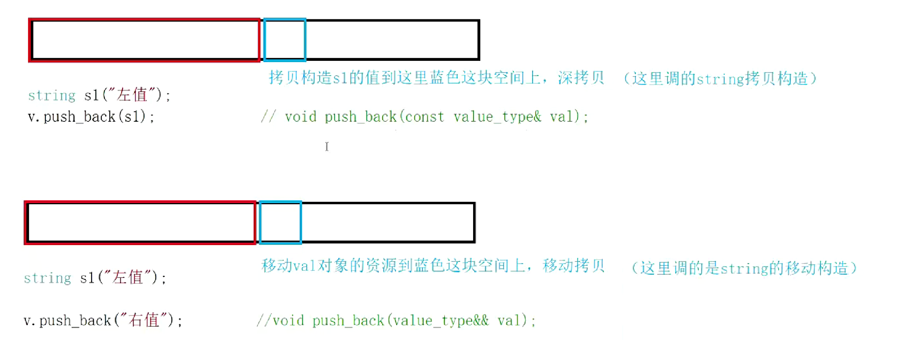

## C++11
### 列表初始化
```
int main()
{
 int x1 = 1;
 int x2{ 2 };
 int array1[]{ 1, 2, 3, 4, 5 };
 int array2[5]{ 0 };
 Point p{ 1, 2 };
 // C++11中列表初始化也可以适用于new表达式中
 int* pa = new int[4]{ 0 };
 return 0;
}
```


```
#include<initializer_list>//可以把它当作容器
int main()
{
	auto ilt1 = { 1,2,3 };
	initializer_list<int>ilt2 = { 1,2,3 };
	return 0;
}
```
> 容器支持花括号初始化，本质是增加一个initializer_list的构造函数，initializer_list可以接收{}列表

### decltype
> 关键字decltype将变量的类型声明为表达式指定的类型

```
int main()
{
    const int x = 1;
    double y = 2.2;
    decltype(x * y) ret; // ret的类型是double
    decltype(&x) p;      // p的类型是int*
    cout << typeid(ret).name() << endl;
    cout << typeid(p).name() << endl;

    return 0;
}
```

### final和override

- final修饰类，类就变成了最终类，不能被继承
- final还可以修饰虚函数，这个虚函数不能被重写
- override是子类重写虚函数，检查是否完成重写，不满足重写的条件则报错


### 新容器

- C++98:string/vector/list/deque/map/set/bitset + stack/queue/priority_queue
- C++11新容器
    - array(定长数组)：实际中用的很少，缺点：定长+存储在栈上
    - forward_list(单链表)：缺点：不支持尾插和尾删+insert数据也是在当前位置的后面
    - unordered_map/unordered_set(推荐使用)，效率比map/set高
### 默认函数控制

```
class A
{
public:
	A() = default;//指定显示去生成默认构造函数
	//要求A的对象不能拷贝和赋值
	//c++98 只声明不实现，private
	//c++11:
	A(const A& aa) = delete;
	A& operator=(const A& aa) = delete;
private:
	int _a;
};
int main()
{
	auto ilt1 = { 1,2,3 };
	initializer_list<int>ilt2 = { 1,2,3 };
	return 0;
}
```

### 引用

- c++98就提出了引用的概念，引用就给一个对象取别名
- c++98 左值引用
- c++11 右值引用
> 左值引用就是给左值取别名，右值引用就是给右值取别名
- 什么是左值---》可以修改就可以认为是左值，左值通常是变量
- 什么是右值---》右值通常是常量，表达式或者函数返回值(临时对象)

```
int main()
{
	//左值引用
	int a = 0;
	int& b = a;
	 
	//int& e = 10;左值引用不能引用右值 const左值引用可以
	const int& e = 10;


	//右值引用
	int x = 1, y = 2;
	int&& c = 10;
	int&& d = x + y;


	//右值引用不能引用左值，但是可以引用move后左值
	//int&& m = a;
	int&& m = move(a);
	return 0;
}
```


```
//c++11又将右值区分为纯右值和将亡值
//纯右值：基本类型的常量或者临时对象
//将亡值：自定义类型的临时对象
//结论：所右的深拷贝都可以加两个右值引用做参数的移动拷贝和移动赋值
class String
{
public:
	String(const char* str = "")
	{
		_str = new char[strlen(str) + 1];
		strcpy(_str, str);
	}
	String(const String& s)
	{
		cout << "String(const String& s)-深拷贝" << endl;
		_str = new char[strlen(s._str) + 1];
		strcpy(_str, s._str);
	}
	String(String&& s)
		:_str(nullptr)
	{
		//传过来的是一个将亡只，反正你都要完了，不如把你的直接给我了
		cout << "String(String&& s)-移动拷贝-效率高" << endl;
		swap(_str, s._str);
	}
    String& operator=(const String& s)
    {
        if (this!= & s)
        {
            char* newstr = new char[strlen(s._str) + 1];
            strcpy(newstr, s._str);

            delete[] _str;
            _str = newstr;
        }
        return *this;
    }

    String& operator=(String&& s)
    {
        cout << "移动赋值" << endl;
        swap(_str, s._str);

        return *this;

    }
	~String()
	{
		delete[] _str;
	}
private:
	char* _str;

};

String f(const char* str)
{
	String tmp(str);
	return tmp;//这里返回实际是拷贝tmp的临时对象
}


int main()
{
	String s1("左值");
	String s2(s1);
	String s3(f("右值-将亡值"));

	//这里只输出了深拷贝
	///理论上应该调用移动构造函数，但编译器仍然进行了 RVO (Return Value Optimiza
	//tion，返回值优化)，直接从函数内部构造到 s3，跳过了中间的临时对象和移动构造。

	return 0;
}

//那由于编译器优化对s3的构造实际调用的是String(const char* str = "")
//{
//	_str = new char[strlen(str) + 1];
//	strcpy(_str, str);
//}
```


> 右值引用本身没太多意义，它实现了移动构造和移动赋值，那么面对接收函数传值返回对象(右值)等等场景，可以提高效率




> 网上有人说尽量用emplace也不尽然，如果我传的是左值那它也得拷贝构造，push类函数我传右值或者加上move也可以有重载函数可以移动赋值和构造，不过，确实在一些场景下避免临时拷贝可以通过它可变参数列表的特点直接传参让它里面进行原地构造


> 总结：
> - 右值引用做参数和返回值都减少拷贝的本质是利用了移动构造和移动赋值
> - 左值和右值引用本质的作用都是减少拷贝，右值引用本质可以认为是弥补左值引用不足的地方
> - 左值引用：解决的是传参过程中和返回值过程中的拷贝
>   - 做参数：void push(T x)---》void push(const T& x)
>   -  做返回值：T f2()-->T& f2()
>   - 但是要注意这里有限制，如果返回对象出了作用域就不能用传引用，这个左值引用没法解决，等待c++1右值引用解决
> - 右值引用：解决的是传参后，函数内部的存储拷贝
>   - 做参数：void push(T&& x)解决的push内部不在使用拷贝构造x到容器空间上，而是移动构造过去
>   - 做返回值：T f2():解决的外面调用接收f2()返回对象的拷贝，T ret=f2(),这里就是右值引用的移动构造，减少了拷贝
>	- 注意：右值引用会在第二次之后的参数传递过程中右值属性丢失，下一层调用会全部识别为左值

### lambda
- 具体使用规则要去看课件

### 线程库

- 特点：跨平台，面向对象封的类(每个线程是一个类对象)
- 实现原理：封装库时使用了条件编译，也就是它的底层还是分别调用了不同平台的线程API