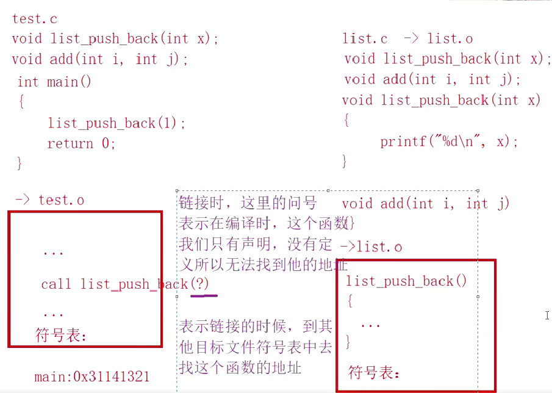
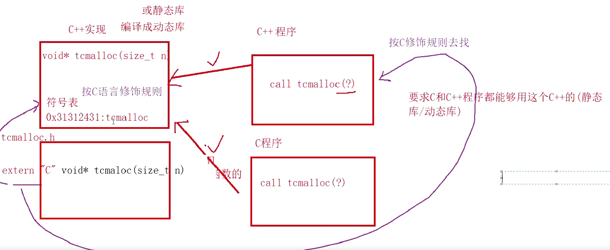
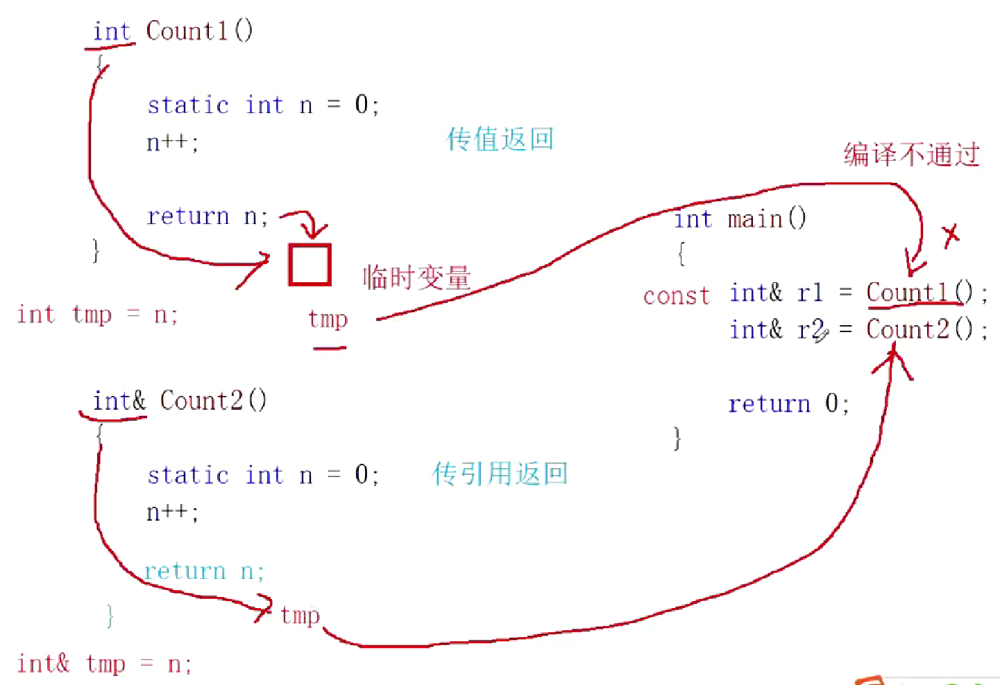
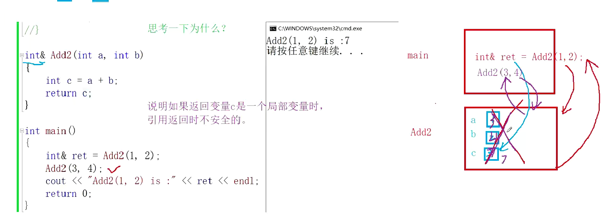

## 函数重载
- 预处理：头文件展开，宏替换，条件编译，去注释
- 编译：检查语法，生成汇编代码
- 汇编：把汇编代码转为二进制机器码
- 链接：将两个目标文件链接到一起

- 每个文件里有对应的符号表，每个符号表里有函数名+对应的地址，一开始test.c文件里只有声明没有实现链接时去list.o里找，通过名字找到地址，再找到对应实现。
- 所以，为啥C++能实现重载呢，问题就出现在名字上，由于c对应符号表里函数名就是函数本身的名字，所以，当名字冲突时，通过函数名找到地址这种方式就冲突了。而C++就是解决了函数名的问题，通过函数本身的名字加上函数的参数(类型，个数，顺序)依据规则给每个函数定义了名字，从而解决了冲突的问题。


- 当函数实现以C++方式最终编成动或静态库，C该怎么找呢》所以得在函数前加上extern "C",一方面使得符号表里以c的规则该函数命名，这样c就找到了，另一方面，让C++以C修饰规则去找它，因为C++兼容C，C++知道它的修饰规则。
- 我们之前经常在一个文件里写代码时写到 extern  类型 变量，作用和上面不一样：告诉编译器，这个变量在其他文件中已经定义好了（分配了内存），你在这里只是使用它，不要在这里重新分配内存

## 引用
```
#include<iostream>
int main()
{
	int c = 1;
	int& d = c;//行
	const int& e = c;//行--》c是可读可写，而e变成别名只读

	const int a = 0;
	//int& b = a;//不行
	//总结：引用取别名时，变量访问的权限可以缩小，不能变大

	int i = 0;
	const int ci = i;
	int x = ci;
	//以上两个都可以，变量之间没有权限缩小和放大的关系，引用才有

	double b = i;//隐式类型转化
	//double& rd = i;报错，因为i-->类型为double的常量--》rd&-->是double&，应该加上const
	const double& rd = i;//正确
	return 0;
}
```

总结：
- 传值就是拷贝，返回的就是临时变量，临时变量具有常性
- 传引用就不是了，本质上传递的就是自身；


```
#include<iostream>
int& Add2(int a, int b)
{
	static int c = a + b;//记住：第一次进入会进行初始化，第二次就不会了，所以第二次不执行这条语句
	//c++;加上这句话就打印出来5了，这很容易理解
	return c; 
}
int main()
{
	int& ret = Add2(1, 2);
	Add2(3, 4);
	std::cout << ret << std::endl;//3
	return 0;
}
```
```
#include<iostream>
int& Add2(int a, int b)
{
	int c = a + b;
	return c; 
}
int main()
{
	int& ret = Add2(1, 2);
	Add2(3, 4);
	std::cout << ret << std::endl;//7
	return 0;
}
```
```
#include<iostream>
int& Add2(int a, int b)
{
	int c = a + b;
	return c; 
}
int main()
{
	int& ret = Add2(1, 2);
	printf("hello world\n");
	std::cout << ret << std::endl;//-858993460---->main栈帧下面是printf，Add2被销毁后覆盖，ret指向的空间也就不确定了
	return 0;
}
```

**一个函数要使用引用返回，返回变量出了这个函数的作用域还存在，就可以使用引用返回，否则就不安全**
- 所以，千万不要放回局部(临时)变量的引用，因为出来就被销毁，那处空间就不安全了，一般要么创建新对象不要返回引用要么直接加上static
## static
关于static，我还有问题：
1. static改变了变量的声明周期对吧，不过静态全局的声明周期本来就是整个运行期，这主要使对局部变量说的；
2. 你谈到的链接性是是什么意思，无连接和内部链接解释一下
3. 静态全局初始化是在启动时，这具体是怎么说的(其实当初我想问的应该是什么时候分配空间的问题），对于一般变量来说，一般是运算到它那里才初始化对吗：

## 1. static 确实主要改变局部变量的生命周期 ✅

你的理解完全正确：

```cpp
void example() {
    int normal = 0;      // 自动存储期：每次调用都重新初始化
    static int persistent = 0;  // 静态存储期：只初始化一次，值在调用间保持
    
    normal++;
    persistent++;
    
    std::cout << "normal: " << normal 
              << ", persistent: " << persistent << std::endl;
}

int main() {
    example();  // 输出: normal: 1, persistent: 1
    example();  // 输出: normal: 1, persistent: 2
    example();  // 输出: normal: 1, persistent: 3
    return 0;
}
```

**关键点**：
- 对于**全局变量**，生命周期本来就是整个程序运行期，`static` 主要改变的是链接性
- 对于**局部变量**，`static` 将其从"自动存储期"变为"静态存储期"

## 2. 链接性（Linkage）详解

### 什么是链接性？
链接性决定了一个名字（变量、函数）在**不同编译单元（.cpp文件）**中的可见性。

### 三种链接性：

#### a) 无链接（No Linkage）
```cpp
void function() {
    int x = 5;           // 无链接：只能在当前函数内访问
    static int y = 10;   // 无链接：虽然生命周期是整个程序，但仍只能在当前函数内访问
    
    // 函数的参数也是无链接
    auto lambda = [](int z) { 
        // z也是无链接
        return z * 2;
    };
}
```

**特点**：
- 只能在定义它们的作用域内访问
- 无法从其他编译单元引用
- 静态局部变量有这种特性

#### b) 内部链接（Internal Linkage）
```cpp
// file1.cpp
static int fileLocal = 100;       // 内部链接
static void helper() { }          // 内部链接

namespace {
    int anonymousVar = 200;       // 匿名命名空间：内部链接（C++方式）
}

// file2.cpp
extern int fileLocal;    // ❌ 链接错误！找不到
extern void helper();    // ❌ 链接错误！
```

**特点**：
- 在当前编译单元（.cpp文件）内可见
- 其他编译单元无法访问
- 避免命名冲突的常用方法

#### c) 外部链接（External Linkage）
```cpp
// file1.cpp
int globalVar = 300;              // 外部链接
void publicFunction() { }         // 外部链接
extern const int extConst = 400;  // 外部链接（const需要显式extern）

// file2.cpp
extern int globalVar;             // ✅ 正确：可以访问
void publicFunction();            // ✅ 正确：可以调用
```

**特点**：
- 可以被其他编译单元访问
- 需要在头文件中声明，使用时包含头文件

## 3. 静态全局变量的初始化时机

### 关键概念区分：

#### a) 内存分配 vs 初始化
```cpp
// 对于静态存储期的变量（全局、static局部、static全局）：
// 1. 内存分配：在程序启动时（main执行前）就分配好
// 2. 初始化时机：取决于具体情况

int global1 = 10;                    // 静态初始化：编译时确定值
int global2 = calculate();           // 动态初始化：main执行前调用calculate()
static int staticGlobal = init();    // 同上

void func() {
    static int localStatic = getValue();  // 第一次执行到此处时初始化
}
```

#### b) 具体的初始化时机

```cpp
#include <iostream>

int calculate() {
    std::cout << "calculate() called" << std::endl;
    return 42;
}

// 全局变量：在main执行前初始化
int g_value = calculate();  // 输出: calculate() called

int main() {
    std::cout << "main() starts" << std::endl;
    
    for (int i = 0; i < 3; i++) {
        static int counter = []() {
            std::cout << "Static local initialized" << std::endl;
            return 0;
        }();  // 第一次循环时初始化
        
        counter++;
    }
    return 0;
}
```

**输出**：
```
calculate() called    // main之前
main() starts
Static local initialized  // 第一次循环
```

### 初始化顺序规则：

#### 1. **静态初始化（零初始化/常量初始化）**
```cpp
int a = 0;            // 零初始化
int b = 100;          // 常量初始化
const int c = 200;    // 常量初始化
```

**发生时机**：程序加载时（编译时已确定值）

#### 2. **动态初始化**
```cpp
int d = someFunction();      // 需要运行时计算
std::string s = "hello";     // 需要调用构造函数
MyClass obj;                 // 需要调用构造函数
```

**发生时机**：
- 对于全局变量：main函数执行之前，但**顺序不确定**
- 对于静态局部变量：第一次执行到声明处时

#### 3. **初始化顺序问题（重要！）**
```cpp
// file1.cpp
int a = initA();  // 可能先执行，也可能后执行

// file2.cpp
int b = initB();  // 不确定顺序！

// 如果initB()依赖于a，可能出问题！
```

**解决方案**：
```cpp
// 使用函数局部静态变量（Meyer's Singleton模式）
int& getA() {
    static int a = initA();  // 第一次调用时初始化
    return a;
}

int& getB() {
    static int b = initB();  // 第一次调用时初始化
    return b;
}

// 使用顺序确定
void useBoth() {
    int valA = getA();  // 确保a先初始化
    int valB = getB();  // 然后b初始化
}
```

### 表格总结：

| 变量类型 | 内存分配时机 | 初始化时机 | 链接性 |
|---------|-------------|-----------|--------|
| 普通全局变量 | 程序启动时 | main之前（顺序不确定） | 外部链接 |
| static全局变量 | 程序启动时 | main之前（顺序不确定） | 内部链接 |
| 普通局部变量 | 函数调用时 | 每次执行到声明处 | 无链接 |
| static局部变量 | 程序启动时 | 第一次执行到声明处 | 无链接 |

### 个人理解 static extern
- 首先，对extern使用分析一下：
    1. 一般用在头文件，这样一个头文件被多个cpp文件包含，这时候头文件里的extern int a；就是告诉编译器，这个变量只是声明，在其它文件里定义，其它文件里共享了该变量
    2. 在多个cpp文件里，一般全局变量默认都是外部链接的，也就是说，没有任何文件包含，我们就可以用它，只需要用extern int 变量就可以了
- 对static使用
    1. 修饰局部变量，功能不具体解释
    2. 修饰全局变量，私有文件里的该内容，这样其它文件用extern 就访问不到了，不过，头文件包含还是能访问到的，所以一般是用在cpp文件里私有内容，与C++里的namespace类似