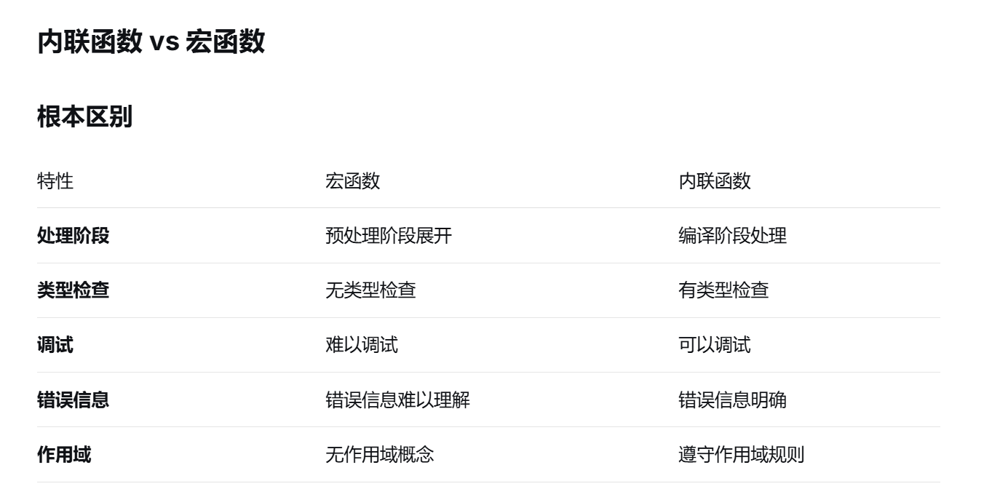
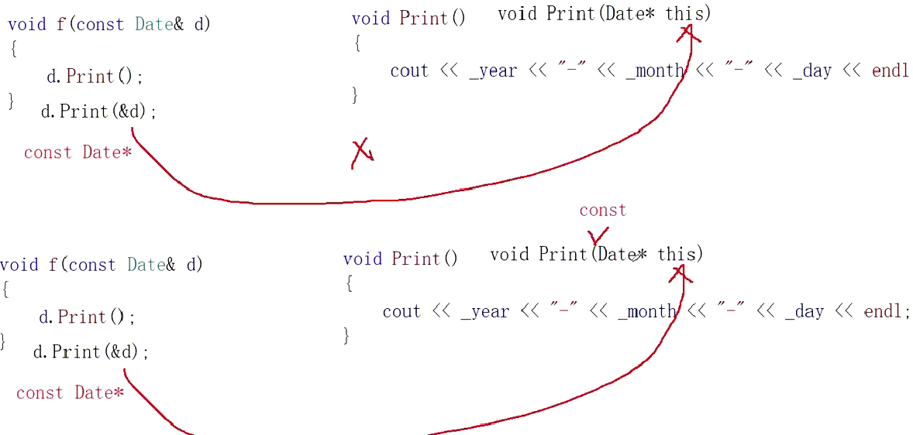
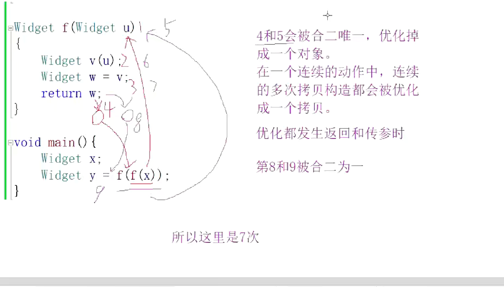

## 内联函数
- 频繁调用函数，调用函数会建立栈帧，是有消耗的
- 在C语言中频繁调用某个函数，为了减少开销，就会使用宏函数
- 宏：在预处理阶段直接展开为内联代码，没有函数调用的开销（参数压栈、跳转、返回等）
- 普通函数：每次调用都有函数调用开销，对于频繁调用的小函数可能成为性能瓶颈
- C++中采用了内联函数
- 内联函数比宏更安全，有类型检查，更好调试
- 宏更灵活，但要注意副作用
- do { ... } while(0) 是编写多语句宏的标准模式，确保宏在各种使用场景下的正确性
- 现代开发中优先考虑内联函数，必须用宏时才使用，并遵循安全模式
- 既然内联函数是在调用时直接展开，找不到地址，那我们就不能把内联函数的声明和定义分离


栈帧（Stack Frame，也叫活动记录 Activation Record）是调用函数时在调用栈（Call Stack）上分配的一块内存区域，用于存储：
1. 函数的局部变量
2. 函数参数
3. 返回地址
4. 调用者的栈帧信息
5. 临时数据
- 关于栈帧的学习其实还不够深入，这只能学点汇编之后再来看了。
- 注意，inline内联函数其实只是用空间换时间，创建栈帧花时间，所以inline就是直接将函数展开，这就可能导致代码变大了。所以，对于一些复杂的函数，即使有inline，编译器也不会把它们当内联函数处理

## NULL nullptr
- 在C++98中，字面常量0既可以是一个整形数字，也可以是无类型的指针(void*)常量，但是编译器默认情况下将其看作一个整形常量，如果要将其按照指针方式来使用，必须对其进行强转(void*)0.
- C++中NULL被定义为0；
- 所以一般表示空指针时，我们用nullptr

## sizeof(对象)
- 通过sizeof(对象)我们能知道，对象中只存储成员变量，不存储成员函数，为啥？
- 一个类实列化出N个对象，每个对象的成员变量都可以存储不同的值，但是调用函数确是同一个，如果每个对象都放成员函数，而这些成员函数确实一样的，浪费空间
- 注意空类的大小，空类比较特殊，编译器给了空类一个字节来标识这个类


## this指针
- this指针存在栈上，因为它是一个形参，vs编译器有优化放在ecx寄存器上；(寄存器
是计算机最快的存储设备，很多经常用的小数据就会放里面)
- 正常情况下这段代码就是会崩
```
struct B
{
	int b;
};
int main()
{
	
	B* tt = NULL;
	tt->b = 1;
	return 0;
}
```
- 看下面这段
```
class A
{
public:
	void Print1()
	{
		std::cout << "hello" << std::endl;
	}
	void Print2()
	{
		std::cout << a << std::endl;
	}
public:
	int a;
};

int main()
{
	A* t=NULL;
	t->Print1();//正常
	t->Print2();//编译通过(只是检查语法),但程序崩溃
	//成员函数存在公共的代码段，所以，p->Print1()这里不会去指针指向的对象去找
	//然后去访问成员函数，通过成员函数找到对象里的参数，需要用到this指针解引用，这时候就会报错了，所以看
	//t->Print2()报错了
	return 0;
}
```
- 总结：通过对象调用函数就是传进去对象地址，通过指针调就是传指针

## 浅拷贝
- 浅拷贝就是一个字节一个字节的拷贝过去
- 浅拷贝的问题：当对象里有指针时，浅拷贝就会导致不同对象里的指针却指向了同一块空间那么，当西沟函数释放空间时，就会导致同一块空间被释放了2次；

## const
- 判断const修饰什么：
- const Date* p1;-->指针指向的对象(const 修饰*p1)
- Date const *p2;-->指针指向的对象
- Date* const p3;-->指针本身(看*位置)
 
- const修饰的对象无法调用对象里非const的函数，非const也是可以调用const函数的；(权限放大缩小的问题)
- void Print()const//-->void Print(const Date* this)


- 结论：什么时候会给成员函数加const--》只要成员函数中不需要修改成员变量最好都加上const；其次，函数的参数如果是引用类型或其它，不用修改的最好也加上，反正const非const都可以传；至于放回值需不需要加上const就要考虑返回的是不是const类型了
## 类内默认函数
- 无参构造
- 析构(可以认为啥也没做)
- 默认的拷贝构造
- 默认的赋值运算符重载
- Date* operator&();//返回对象地址,一般我们不会再写，除非我们不想要返回它的地址
- const Date* operator&();

## 成员初始化列表
- 是对象的成员变量的定义的地方
- 有些成员变量要求必须在成员初始化列表上定义即初始化，如const，引用，没有默认构造函数的对象
- 初始化的顺序与初始化列表的顺序无关，和声明的顺序有关

## cout和cin
- 为什么能识别不同类型，因为有函数重载

## static
- static修饰的函数不能访问类内其它成员，因为它没有this指针
- 但是，类内其它成员函数是可以访问的；


## 链表和顺序表(数组)
- 区别与联系：
	1. 顺序表是在数组的基础上实现增删查改，并且插入时可以动态增长
		a. 可能存在一定空间浪费
		b. 增容有一些效率损失(开空间，拷贝，释放旧空间)
		c. 中间或者头部删除，时间复杂度为O(n),因为要挪动数据
	2. 这些问题很明显链表是可以解决的，但不能忽视链表的缺陷：不能随机访问
	3. 互补的数据结构
## 对象的拷贝编译器可能的优化
