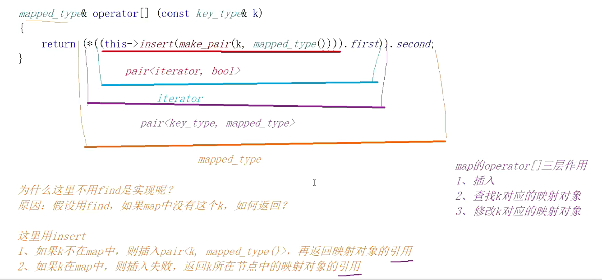

### map和set使用
- 序列式容器：vector/list/string/deque
- 关联式容器：map/set/unordered_map/unordered_set

```
#include<iostream>
#include<set>
using namespace std;
int main()
{
	set<int>s;//key模型
	s.insert(12);
	s.insert(2);
	s.insert(15);
	s.insert(34);
	s.insert(2);
	set<int>::iterator it = s.begin();
	//排序+去重
	while (it != s.end())
	{
		cout << *it << " ";
		it++;
	}
	cout << endl;
	for (auto e : s)
	{
		cout << e << " ";
	}
	cout << endl;
	set<int>copy(s);
	for (auto e : copy)
	{
		cout << e << " ";
	}
	cout << endl;
	//和其它容器使用方式基本一样

	set<int>::iterator pos = s.find(10);//找不到返回end
	set<int>::iterator pos = find(s.begin(),s.end(),3);//这是算法里的find
	//这两个find的区别：第一个效率为logn，第二个各种容器都可以用，效率为n
	if(pos!=s.end())
		s.erase(pos);
	s.erase(10);
	//如果传位置就要保证位置的可靠性，传值就无所谓了
	for (auto e : s)
	{
		cout << e << " ";
	}
	return 0;
}
```
- set特点：快
- 增删查：logn，不允许修改

```
#include<iostream>
#include<set>
#include<map>
using namespace std;
int main()
{
	map<int, int>m;//key value模型
	//m.insert(1, 1);错误
	m.insert(pair<int, int>(1, 1));
	m.insert(pair<int, int>(2, 2));//pair(匿名对象)构造函数
	m.insert(make_pair(4, 4));//函数模板构造一个pair对象，更喜欢用这种
	map<int, int>::iterator it = m.begin();
	while (it != m.end())
	{
		cout << (*it).first << " " << (*it).second << endl;
		cout << it->first << " " << it->second << endl;
		it++;

	}
	cout << endl;
	for (auto e : m)
	{
		cout << e.first << " " << e.second << endl;
	}
	return 0;
}

#include<iostream>
#include<set>
#include<map>
using namespace std;
int main()
{
	map<string, int>m;//key value模型
	string strs[] = { "苹果","西瓜","土豆","苹果","西瓜","土豆", "苹果","西瓜","土豆" };
	m["香蕉"];//插入
	m["香蕉"] = 1;//修改
	cout << m["香蕉"] << endl;//查找
	m["香蕉"] = 5;//插入+修改
	for (auto e : strs)
	{
		/*map<string, int>::iterator ret = m.find(e);
		if (ret != m.end())
		{
			ret->second++;
		}
		else
		{
			m.insert(make_pair(e, 1));
		}*/
		pair<map<string, int>::iterator, bool> ret = m.insert(make_pair(e, 1));
		if (ret.second == false)
		{
			ret.first->second++;
		}
	}
	for (auto e : m)
	{
		cout << e.first << " " << e.second << endl;
	}
	return 0;
}
```
- insert的使用：如果有就不插入，这时返回的pair里第一个参数迭代器为有的那一个，第二个参数为false，如果没有就插入，这时候返回的pair里第一个参数迭代器新插入的那个，第二个参数为true



- 一般使用operator[]去
- 插入+修改
- 修改
- 一般不会做查找，因为如果不在会插入数据。

- map
- 增  insert+operator[]
- 删  erase
- 查  find
- 改  operator[]
- 遍历 iterator+范围for
- 要注意map中存的是pair<k,v>键值对
- 遍历出来的数据是按k排序的，因为底层是搜索树遍历走的树的中序