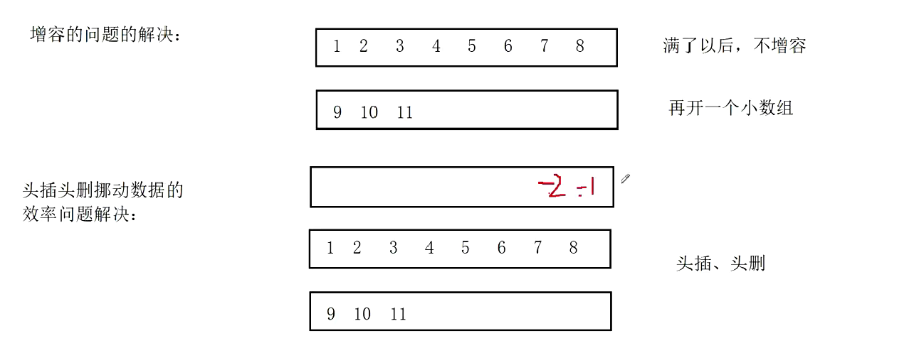
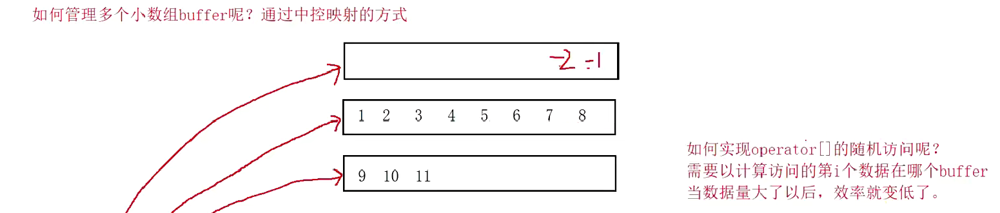
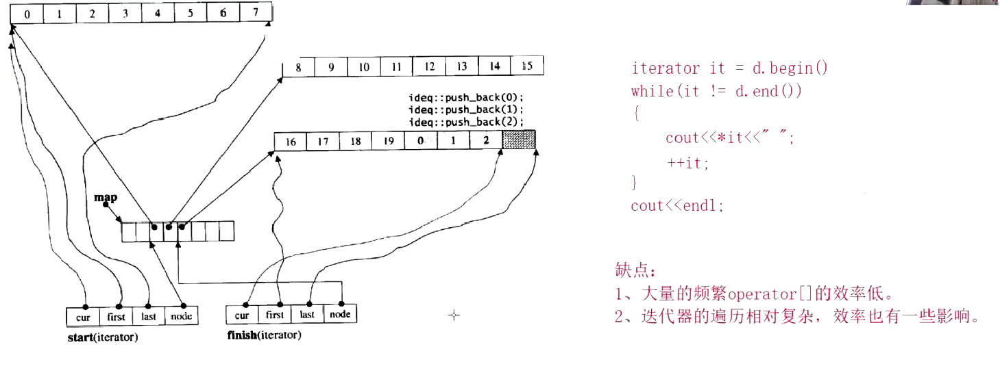

```
int main()
{
	stack<int>st;
	st.push(1);
	st.push(2);
	st.push(3);
	st.push(4);
	//stack没有迭代器
	while (!st.empty())
	{
		cout << st.top()<<" ";
		st.pop();
	}
	cout << endl;
	queue<int>qu;
	qu.push(1);
	qu.push(2);
	qu.push(3);
	qu.push(4);
	while (!qu.empty())
	{
		cout << qu.front() << " ";
		qu.pop();
	}
	return 0;

}
```

```
#pragma once
namespace wuwu
{
	template <class T,class Container>
	class stack
	{
	public:
		void push(const T& x)
		{
			_con.push_back(x);
		}
		void pop()
		{
			_con.pop_back();
		}
		size_t size()
		{
			return _con.size();
		}
		bool empty()
		{
			return _con.empty(); 
		}
		T& top()
		{
			return _con.back();
		}
	private:
		Container _con;
	};
	void test_stack()
	{
		stack<int, vector<int>>st;
		st.push(1);
		st.push(2);
		st.push(3);
		while (!st.empty())
		{
			cout << st.top() << " ";
			st.pop();
		}
		cout << endl;
	}
}
```

```
#pragma once
namespace hehe
{
	template <class T, class Container>
	class queue
	{
	public:
		void push(const T& x)
		{
			_con.push_back(x);
		}
		void pop()
		{
			_con.pop_front();
		}
		size_t size()
		{
			return _con.size();
		}
		bool empty()
		{
			return _con.empty();
		}
		T& front()
		{
			return _con.front();
		}
		T& back()
		{
			return _con.back();
		}
	private:
		Container _con;
	};
	void test_queue()
	{
		//stack<int, vector<int>>st;不能用vector,因为没有pop_front()
		queue<int, list<int>>st;
		st.push(1);
		st.push(2);
		st.push(3);
		while (!st.empty())
		{
			cout << st.front() << " ";
			st.pop();
		}
		cout << endl;
	}
}
```

**总结**：queue和stack是通过容器适配转换过来的，不是原生实现的
而我们之前写的stl里的stack和queue默认的适配器是queue

对于queue来说：
- 支持任意位置插入删除，也支持随机访问，也就是说它既有vector的优点，也有list的优点
- 所以，看起来它好像是可以替代vector和list的一个容器，但是，实际上它随机访问的效率是不容乐观的，所以也就没法替代vector和list
那么，为什么栈和队列的适配又可以使用它呢？
- 头尾的插入和删除效率还是可以的，stack和queue并没有使用到它的随机访问


**https://leetcode.cn/problems/bao-han-minhan-shu-de-zhan-lcof/submissions/650624613/**
```
class MinStack {
public:
    /** initialize your data structure here. */
    stack<int>v1;
    stack<int>v2;
    MinStack() {
        
    }
    
    void push(int x) {
        v1.push(x);
        if(v2.empty()||v2.top()>=x)v2.push(x);
    }
    
    void pop() {
        
        if(!v2.empty()&&v2.top()==v1.top())v2.pop();
        if(!v1.empty())
        v1.pop();

    }
    
    int top() {
        return v1.top();
    }
    
    int getMin() {
        return v2.top();
    }
};
```

**https://www.nowcoder.com/practice/d77d11405cc7470d82554cb392585106?tpId=13&tqId=11174&ru=/exam/oj**
```
class Solution {
public:
    /**
     * 代码中的类名、方法名、参数名已经指定，请勿修改，直接返回方法规定的值即可
     *
     * 
     * @param pushV int整型vector 
     * @param popV int整型vector 
     * @return bool布尔型
     */
    bool IsPopOrder(vector<int>& pushV, vector<int>& popV) {
        // write code here
        int n=pushV.size();
        stack<int>ret;
        int k=0;
        for(int i=0;i<n;i++)
        {
            ret.push(pushV[i]);
            while(!ret.empty()&&ret.top()==popV[k])
            {
                ret.pop();
                k++;
            }
        }
        return ret.empty();
    }
};
```
**https://leetcode.cn/problems/8Zf90G/submissions/650955146/**
```
class Solution {
public:
    int evalRPN(vector<string>& tokens) {
        stack<int>ret;
        int n=tokens.size();
        for(int i=0;i<n;i++)
        {
            if(tokens[i]!="+"&&tokens[i]!="-"&&tokens[i]!="*"&&tokens[i]!="/")
                ret.push(stoi(tokens[i]));
            else
            {
                int tmp1,tmp2,tmp3;
                tmp2=ret.top();
                ret.pop();
                tmp1=ret.top();
                ret.pop();
                if(tokens[i]=="+")tmp3=tmp1+tmp2;
                if(tokens[i]=="-")tmp3=tmp1-tmp2;
                if(tokens[i]=="*")tmp3=tmp1*tmp2;
                if(tokens[i]=="/")tmp3=tmp1/tmp2;
                ret.push(tmp3);
            }
        }
        return ret.top();
    }
};
```

**vector缺点：头插头删效率低，空间不够了增容代价大
list缺点：不支持随机访问
面试问题：能否设计出一个数据结构解决以上问题?**
>参考deque的设计
>deque的缺点：1. 大量的频繁operator[]的效率低
>迭代器的遍历相对复杂，效率也有一些低下(对比vector，一起去对相同的10w个数据排序，deque效率相比vector差了4-5倍)



### 初识priority_queue
```
//void test_priority_queue()
//{
//	//std:: priority_queue<int>pq;//默认大的优先级高
//	std::priority_queue<int, std::vector<int>, std::greater<int>>pq;//小的优先级高
//	pq.push(1);
//	pq.push(3);
//	pq.push(10);
//	pq.push(3);
//	pq.push(6);
//	while (!pq.empty())
//	{
//		std::cout << pq.top() << " ";
//		pq.pop();
//	}
//	std::cout << std::endl;
//}
//注意，可不是说push后里面就给你自动排序，里面维持着的是一个堆(大或小)，top()->最大/最小，可以利用它来排序
```
### 模拟实现priority_queue
```
#include<iostream>
#include<vector>
using namespace std;
namespace sss
{
	template<class T,class Container=vector<T>>
	class priority_queue
	{
	public:
		void AdjustUp(int n)
		{
			int child = n;
			int parent = (child - 1) / 2;
			while (child > 0)
			{
				if (_con[child] > _con[parent])
				{
					swap(_con[child], _con[parent]);
					child = parent;
					parent = (child - 1) / 2;
				}
				else break;
			}
		}
		void Adjustdown(int n)
		{
			int parent = n;
			int child = 2 * parent + 1;
			while (child < _con.size())
			{
				if (child + 1 < _con.size() && _con[child] < _con[child + 1])child++;
				if (_con[child] > _con[parent])
				{
					swap(_con[child], _con[parent]);
					parent = child;
					child = 2 * parent + 1;
				}
				else break;
			}
		}
		void push(const T& x)
		{
			_con.push_back(x);
			AdjustUp(_con.size() - 1);
		}
		void pop()
		{
			swap(_con[0], _con[_con.size() - 1]);
			_con.pop_back();
			Adjustdown(0);
		}
		T& top()
		{
			return _con[0];
		}
		size_t size()
		{
			return _con.size();
		}
		bool empty()
		{
			return _con.empty();
		}
	private:
		Container _con;
	};
	void test_priority_queue()
	{
		priority_queue<int>qu;
		qu.push(1);
		qu.push(10);
		qu.push(8);
		qu.push(5);
		qu.push(22);
		while (!qu.empty())
		{
			cout << qu.top() << " ";
			qu.pop();
		}
	}
}
int main()
{
	sss::test_priority_queue();
	return 0;
}
```
- 仿函数
```
namespace ccc
{
	template<class T>
	struct less
	{
		bool operator()(const T& x1, const T& x2)
		{
			return x1 < x2;
		}
	};
}
int main()
{
	ccc:less<int>lessfunc;
	cout << lessfunc(1, 2) << endl;//
	less<int>lessfunc;//std里有一个默认的
	lessfunc.operator()(1,2)
	//看起来就像调用函数一样，但其实是对象
	return 0;
}
```
```
#include<iostream>
#include<vector>
using namespace std;
namespace sss
{
	template<class T,class Container=vector<T>,class Compare=less<T>>//虽然默认是大堆，但是实际上给了less(有点挫)
	class priority_queue
	{
	public:
		void AdjustUp(int n)
		{
			Compare com;
			int child = n;
			int parent = (child - 1) / 2;
			while (child > 0)
			{
				//if (_con[child] > _con[parent])
				if(com(_con[parent],_con[child]))//要记得换一下顺序，因为默认给了less
				{
					swap(_con[child], _con[parent]);
					child = parent;
					parent = (child - 1) / 2;
				}
				else break;
			}
		}
		void Adjustdown(int n)
		{
			Compare com;
			int parent = n;
			int child = 2 * parent + 1;
			while (child < _con.size())
			{
				//if (child + 1 < _con.size() && _con[child] < _con[child + 1])child++;
				if (child + 1 < _con.size() && com(_con[child], _con[child + 1]))child++;
				//if (_con[child] > _con[parent])
				if(com(_con[parent],_con[child]))
				{
					swap(_con[child], _con[parent]);
					parent = child;
					child = 2 * parent + 1;
				}
				else break;
			}
		}
		void push(const T& x)
		{
			_con.push_back(x);
			AdjustUp(_con.size() - 1);
		}
		void pop()
		{
			swap(_con[0], _con[_con.size() - 1]);
			_con.pop_back();
			Adjustdown(0);
		}
		T& top()
		{
			return _con[0];
		}
		size_t size()
		{
			return _con.size();
		}
		bool empty()
		{
			return _con.empty();
		}
	private:
		Container _con;
	};
	void test_priority_queue()
	{
		priority_queue<int,vector<int>,greater<int>>qu;
		//priority_queue<int>qu;
		qu.push(1);
		qu.push(10);
		qu.push(8);
		qu.push(5);
		qu.push(22);
		while (!qu.empty())
		{
			cout << qu.top() << " ";
			qu.pop();
		}
	}
}
```

```
#include<algorithm>
int main()
{
	//sss::test_priority_queue();

	vector<int>v;
	v.push_back(3);
	v.push_back(13);
	v.push_back(33);
	v.push_back(1);
	v.push_back(99);
	sort(v.begin(), v.end());//默认升序
	for (auto i : v)
	{
		cout << i << " ";
	}
	greater<int> gt;
	sort(v.begin(), v.end(),gt);//变成降序
	//注意 sort是函数模板，所以传的是参数，所以要传对象gt，之前是模拟实现priority_queue
	//是类模板，类模板传递的是类型
	//实际当中更喜欢这样
	sort(v.begin(), v.end(), greater<int>());
	for (auto i : v)
	{
		cout << i << " ";
	}
	return 0;
}
```
### 总结
- 六大组件已经学了5种
- 容器：string/vector/list/deque
- 适配器：stack/queue/priority_queue
- 迭代器：iterator/const_iterator/reverse_iterator/const_reverse_iterator
- 算法：sort/find/reverse
- 仿函数：less/greater
