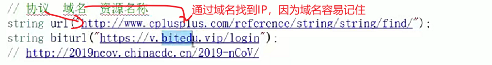

## string使用
**增操作**
```
int main()
{
	string b;
	b.append("haha");
	b.push_back('A');
	cout << b;
	//都可以用+=直接用
	return 0;
}
```
**遍历操作**
**为啥要用迭代器**
>可以用[]访问，但是只有vector和string有
其它容器不行，所以用了迭代器
```
#include<iostream>
#include<assert.h>
#include<string>
using namespace std;
int main()
{
    string a = "hello world";
    string::iterator it = a.begin();//auto it=a.begin()
    //begin返回的是迭代器类型
    cout << *it << " ";
    //迭代器：
    //1.迭代器不一定是指针，但很像指针
    while (it != a.end())//end指向的是最后一个字符的再后一个
    {
        cout << *it << " ";
        it++;
    }
    //范围for
    //1.自动把a里的给了t
    //2.自动加加
    //3.原理：被替换成迭代器类似于上面代码
    for (auto t : a)
    {
        cout << t << " ";
    }

    //其它迭代器
    //反向
    string::reverse_iterator it = a.rbegin();
    while (it != a.rend())
    {
        cout << *it << " ";
        it++;
    }

    //常量
    //只能读不能写
    const string a = "hello world";
    string::const_iterator it = a.begin();
    while (it != a.end())
    {
        cout << *it << " ";
        it++;
    }

    const string a = "hello world";
    string::const_reverse_iterator it = a.rbegin();
    while (it != a.rend())
    {
        cout << *it << " ";
        it++;
    }

    //总结：一共4种
    //属性：普通/常量
    //方向：正向与反向

}
```

**对size和capacity的操作**
>String::npos是一个特殊的常量值，通常用于表示“无效位置”或“不存在的位置”。通常被定义为-1，但以size_t形式表示
```
#include<iostream>
#include<assert.h>
#include<string>
using namespace std;
int main()
{
    string a = "hello world";
    cout << a.size() << endl;//10
    cout << a.length() << endl;//10
    cout << a.capacity() << endl;//差不多每次一超出就倍数式（1.5-2）增
    a.clear();
    cout << a << endl;
    cout << a.capacity() << endl;//虽然字符串清空了但容量不变

    string a = "hello world";
    a.reserve(100);//也可以一开始就预留空间，不用每次一不够就又开辟空间
    cout << a.capacity() << endl;//111->实际应该是112，因为还有\0
    a.resize(20, 'a');//把字符的个数更新到20，不够默认补\0，如果字符过多去掉后面达到预定的数目，这个操作有时间接改变了capacity
    cout << a << endl;
    
    string a = "hello world";
    a.insert(a.begin(), '3');//如果要插入一个字符，第一个参数传递的是迭代器
    a.insert(0, "3");//插入字符串，传位置就可以了
    //但为了追求便利性，一般用第二个就可以了
    a.erase(2, 4);//删除任意位置任意个字符
}

```
**c_str()**
```
#include<iostream>
#include<assert.h>
#include<string>
using namespace std;
int main()
{
    string b = "a-bC-dEf-ghIj";
    const char* a = b.c_str();//获取字符数组首地址，用c字符串的形式遍历
    while (*a)
    {
        cout << *a << " ";
        ++a;
    }
    cout << b.c_str() << endl;//直接输出const char*  //遇到\0停止输出
    cout << b;//调用的是string重载operator<<			//将对象里字符全部输出

    b+='\0';
    b+="world";//上面两个输出会有所不同
}
```
```
int main()
{
    string a = "hello\0world";
    cout << a.size();//5 
    cout << a;//hello
    string b = "hello";
    b += '\0';
    b += "world";
    cout << b.size();//11
    cout << b;//helloworld(中间\0打印不出）
    return 0;
}
```
**substr find getline**
```
#include<iostream>
#include<assert.h>
#include<string>
using namespace std;
int main()
{
    string s1("string.cpp");
    size_t pos1 = s1.find('.');//如果没找到会返回npos
    if (pos1 != string::npos)
    {
        cout << s1.substr(pos1) << endl;
    }

    string s1("https://legacy.cplusplus.com/doc/");
    size_t pos1 = s1.find(':');
    if (pos1 != string::npos)
    {
        cout << s1.substr(0,pos1) << endl;
    }
    size_t pos2 = pos1 + 3;
    size_t pos3 = s1.find('/', pos2);
    if (pos3 != string::npos)
    {
        cout << s1.substr(pos2,pos3-pos2) << endl;
        cout << s1.substr(pos3 + 1);
    }

    cin>>s;//遇到空格或换行停止
    getline(cin,s);//遇到换行停止
}
```

