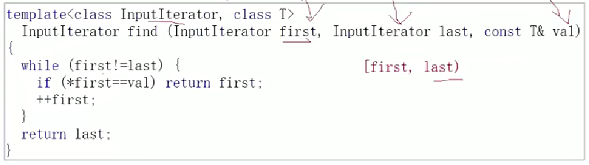

# vector
1. 遍历方式
    - for循环
    ```
    vector<int>a;
	a.push_back(1);
	a.push_back(2);
	a.push_back(3);
	a.push_back(4);
	vector<int>b(a);//拷贝构造
	for (int i = 0; i < a.size(); i++)
	{
		cout << a[i] << " ";
	}
	for (int i = 0; i < a.size(); i++)
	{
		cout << b[i] << " ";
    }
    ```
    - 范围for
    ```
    for (auto i : a)
	{
		cout << i<< " ";
	}
    ```
    - 迭代器
    ```
    vector<int>::iterator it = a.begin();
	while (it != a.end())
	{
		cout << *it << " ";
	    it++;
	}
	```
2. 迭代器相关知识
```
int main()
{
	
	//迭代器
	 vector<int>a;
	a.push_back(1);
	a.push_back(2);
	a.push_back(3);
	a.push_back(4);
	//1.普通正向
	vector<int>::iterator it = a.begin();
	while (it != a.end())
	{
		cout << *it << " ";
		it++;
	}
	cout << endl;
	//2.const类型，只能访问，不能修改
	const vector<int>b(a);//一般不会定义const对象，因为无意义。实际过程中只有在函数传参才会用到
	vector<int>::const_iterator itt = b.begin();
	while (itt != b.end())
	{
		cout << *itt << " ";
		itt++;
	}
	cout << endl;
	//3.反向
	vector<int>c(a);
	vector<int>::reverse_iterator ittt = c.rbegin();
	while (ittt != c.rend())
	{
		cout << *ittt << " ";
		ittt++;

	}
	
	return 0;
}
```

3. vector 的扩容
vector扩容时，在linux下是以两倍的空间扩，但在windows下是以1.5倍，这两种扩容方式的优缺点：
- 对于2倍来说，相对而言，效率更好，但浪费的空间更多。
- 对于1.5倍来说，增容次数更多，效率更低，因为每次增容都要付出代价
- 增多少是一种选择，各有利弊
- 如果自己选择增容大小，用reserve，不过，也可以用resize，它既增容，也增了大小，但容量不一定是某某值
4. 常用函数
```
int main()
{
	vector<int>a;
	a.push_back(1);
	a.push_back(2);
	a.push_back(3);
	a.push_back(4);
	for (auto i : a)
	{
		cout << i << " ";
	}
	cout << endl;
	a.erase(a.begin());//vector中传的是迭代器
	a.insert(a.end(), 10);
	vector<int>::iterator pos=find(a.begin(), a.end(), 10);//值得注意的是，vector没有提供find函数，
	//但是我们可以调用algorithm里的find函数
	a.erase(pos);//如果找到了返回该位置的迭代器，找不到返回a.end();
	for (auto i : a)
	{
		cout << i << " ";
	}
	return 0;
}
```


力扣题**https://leetcode.cn/problems/single-number/submissions/644013678/**

^=异或：相同为0，相异为1
```
class Solution {
public:
    int singleNumber(vector<int>& nums) {
        int sum=0;
        for(auto i:nums)
        {
            sum^=i;
        }
        return sum;
    }
};
```
这道题除了可以用异或解决，还可以通过与运算(&)和或运算(|)，本质上就是通过规律：1|0=1；1&0=0；
```
class Solution {
public:
    int singleNumber(vector<int>& nums) {
        int ans[32]={0};
        for(auto e:nums)
        {
            for(size_t i=0;i<32;i++)
            {
                if(e&1<<i)
                {
                    ans[i]++;
                }
            }
        }
        int ret=0;
        for(size_t i=0;i<32;i++)
        {
            if(ans[i]%2==1)
            {
                ret|=1<<i;
            }
        }
        return ret;
    }
};
```

**https://leetcode.cn/problems/WGki4K/description/**

如果遇到这道题就只能用第2种解法
```
class Solution {
public:
    int singleNumber(vector<int>& nums) {
        int ans[32]={0};
        for(auto e:nums)
        {
            for(size_t i=0;i<32;i++)
            {
                if(e&1<<i)
                {
                    ans[i]++;
                }
            }
        }
        int ret=0;
        for(size_t i=0;i<32;i++)
        {
            if(ans[i]%3==1)
            {
                ret|=1<<i;
            }
        }
        return ret;
    }
};
```

**https://leetcode.cn/problems/single-number-iii/submissions/644213799/**
```
class Solution {
public:
    vector<int> singleNumber(vector<int>& nums) {
        int cur=0;
        for(auto i:nums)
        {
            cur^=i;
        }
        size_t i=0;
        for(;i<32;i++)
        {
            if(cur & 1<<i)break;
        }
        int ret1=0;
        int ret2=0;
        for(auto e:nums)
        {
            if(1<<i & e)
            {
                ret1^=e;
            }
            else
            {
                ret2^=e;
            }
        }
        vector<int>ret;
        ret.push_back(ret1);
        ret.push_back(ret2);
        return ret;
    }
};
```
**https://leetcode.cn/problems/pascals-triangle/submissions/644573792/**
```
class Solution {
public:
    vector<vector<int>> generate(int numRows) {
        vector<vector<int>> ret;
        ret.resize(numRows);
        for(size_t i=0;i<numRows;i++)
        {
            ret[i].resize(i+1);
            ret[i][0]=1;
            ret[i][ret[i].size()-1]=1;
        }
        for(size_t i=0;i<numRows;i++)
        {
            for(size_t j=0;j<ret[i].size();j++)
            {
                if(ret[i][j]!=1)
                {
                    ret[i][j]=ret[i-1][j-1]+ret[i-1][j];
                }
            }
        }
        return ret;
    }
};
```

5. 迭代器失效
    - 由于内存发生改变，是通过先开辟空间，再将原来的空间的内容拷贝到新开辟的空间里，所以，原来it指向的内容就失效了，造成vs报错
    ```
    vector<int>a;
    a.push_back(1);
    a.push_back(2);
    a.push_back(3);
    a.push_back(4);
    a.push_back(5);
    vector<int>::iterator it = a.begin();
    while (it != a.end())
    {
        cout << *it << " ";
        it++;
    }
    a.push_back(6);
    a.push_back(7);
    cout<<*it//报错
    ```
    - 这段代码再vs下是一定会报错的，因为2是偶数，被删除后3就替代了它的位置，但it++了即3不会被访问到，所以因为vs会进行检查，就会报错，用gcc或在linux环境下可能会报错，但报的不是这个错误，而是有可能访问越界
    ```
    int main()
    {
        vector<int>a;
        a.push_back(1);
        a.push_back(2);
        a.push_back(3);
        a.push_back(4);
        a.push_back(5);
        vector<int>::iterator it = a.begin();
        while (it != a.end())
        {
            if (*it % 2 == 0)
                a.erase(it);
            it++;
        }
    }
    ```
    应该将里面改成这样:
    ```
    if (*it % 2 == 0)
	    it=a.erase(it);//返回值就是下一个值的位置
    else
	    it++;
    ```
