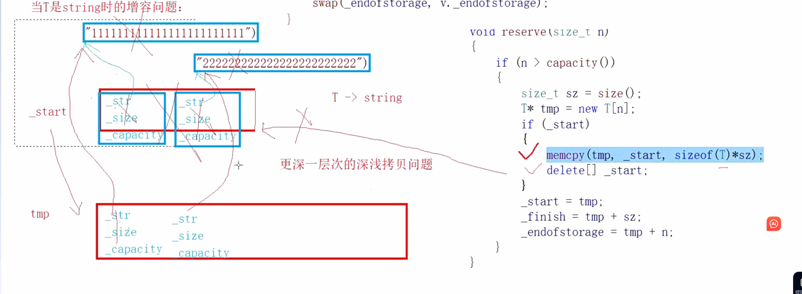

## vector的模拟实现

```
#pragma once

#include<assert.h>
namespace zhouzichong
{
	template<class T>
	class vector
	{
	public:
		typedef T* iterator;
		
		vector() :_start(nullptr), _finish(nullptr), _endofstorage(nullptr)
		{

		}
		~vector()
		{
			delete[]_start;
			_start = _finish = _endofstorage = nullptr;
		}
		vector(const vector<T>& x)
		{
			_start = new T[x.capacity()];
			_finish = _start;
			_endofstorage = _start+x.capacity();
			for (size_t i = 0; i < x.size(); i++)
			{
				*_finish = x[i];
				_finish++;
			}

		}
		//也可以用这种写法
		/*vector(const vector<T>& v):_start(nullptr),_finish(nullptr),_endofstorage(nullptr)
		{
			reserve(v.capacity());
			for (const auto& e : v)
			{
				push_back(e);
			}
		}*/
		vector<T>& operator=(const vector<T>& v)
		{
			if (this != &v)
			{
				delete[]_start;
				_start = new T[v.capacity()];
				memcpy(_start, v._start, sizeof(T) * v.size());
				_finish = _start + v.size();
				_endofstorage = _start + v.capacity();
			}
			return *this;
		}
		//也可以这么写
		/*vector<T>&^ operator=(vector<T> v)
		{
			swap(v);
			return *this;
		}*/

		void swap(vector<int>& T)
		{
			::swap(_start, v._start);
			::swap(_finish, v._finish);
			::swap(_endofstorage, v._endofstorage);
		}
		//为啥要自己写一个swap,因为直接swap()就要有3次深拷贝，所以干脆自己写一个直接指针来交换
		void push_back(const T& k)
		{
			/*if (_finish == _endofstorage)
			{
				size_t newcapacity = capacity() == 0 ? 2 : capacity()* 2;
				reserve(newcapacity);
			}
			*_finish = k;
			_finish++;*/
			insert(_finish, k);
		}
		void reserve(size_t k)
		{
			if (k > capacity())
			{
				size_t sz = size();//先记录size的值
				T* tmp = new T[k];
				if (_start)
				{
					//memcpy(tmp, _start, sizeof(T) * sz);按字节拷贝，浅拷贝
					// 这么写实际上是错误的，当是string类型就会出错，具体原因看下面图片
					for (size_t i = 0; i < sz; i++)
					{
						tmp[i] = _start[i];//调用的是T的operator=深拷贝
					}
					delete[]_start;
				}
				/*_start = tmp;
				_finish = tmp + size();
				_endofstorage = tmp + capacity();*/
				//这么写是不对的：首先，当你把_start指向tmp,然后又用到了size(),而size()返回的是_finish-_start,这里就完全不对了，还有capacity也是同样的道理
				_start = tmp;
				_finish = tmp + sz;
				_endofstorage = tmp + k;
			}
		}

		size_t size()const//让const对象也能调用
		{
			return _finish - _start;
		}
		size_t capacity()const
		{
			return _endofstorage - _start;
		}
		iterator begin()
		{
			return _start;
		}
		iterator end()
		{
			return _finish;
		}
		T& operator[](size_t i)
		{
			assert(i <size());
			return _start[i];
		}
		const T& operator[](size_t i)const
		{
			assert(i < size());
			return _start[i];
		}
		void pop_back()
		{
			assert(_finish > _start);
			_finish--;
		}
		void insert(iterator pos, const T& x)
		{
			//assert(pos <= _finish);
			//if (_finish == _endofstorage)
			//{
			//	size_t newcapacity = capacity() == 0 ? 2 : capacity() * 2;
			//	reserve(newcapacity);
			//}
			//iterator End = _finish - 1;
			//while (End>=pos)
			//{
			//	*(End + 1) = *End;//第一次写运行报错，因为迭代器失效的问题，如果扩容了pos指向的是旧空间，
			//	End--;
			//}
			//*pos = x;
			//++_finish;
			assert(pos <= _finish);
			if (_finish == _endofstorage)
			{
				int n = pos - _start;
				size_t newcapacity = capacity() == 0 ? 2 : capacity() * 2;
				reserve(newcapacity);
				pos = _start + n;
			}
			iterator End = _finish - 1;
			while (End >= pos)
			{
				*(End + 1) = *End;//第一次写运行报错，因为迭代器失效的问题，如果扩容了pos指向的是旧空间，
				End--;
			}
			*pos = x;
			++_finish;
		}
		iterator erase(iterator pos)
		{
			assert(pos < _finish);
			iterator it = pos;

			while (it < _finish)
			{
				*it = *(it + 1);
				++it;
			}
			--_finish;
			return pos;
		}
		void resize(size_t n, const T& x = T())
		{
			if (n < size())
			{
				_finish = _start + n;
			}
			else
			{
				if (n > capacity())
				{
					reserve(n);
				}
				while (_finish < _start + n)
				{
					*_finish = x;
					_finish++;
				}
			}
		}
	private:
		iterator _start;
		iterator _finish;
		iterator _endofstorage;

	};
	void test()
	{
		vector<int> a;
		a.push_back(1);
		a.push_back(2);
		a.push_back(3);
		a.push_back(4);
		a.push_back(5);
		a.push_back(6);

		vector<int>::iterator it = a.begin();
		while (it != a.end())
		{
			cout << *it << " ";
			it++;
		}
		a.erase(a.begin());
		cout << endl;
		//a.resize(10, 111);
		vector<int>b = a;
		b.push_back(12);
		cout << *(b.end()-1) << endl;
		for (size_t i = 0; i < b.size(); i++)
		{
			cout << b[i] << " ";
		}
	}
}

```

