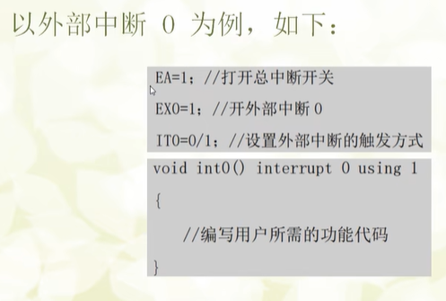
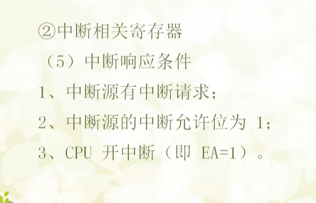
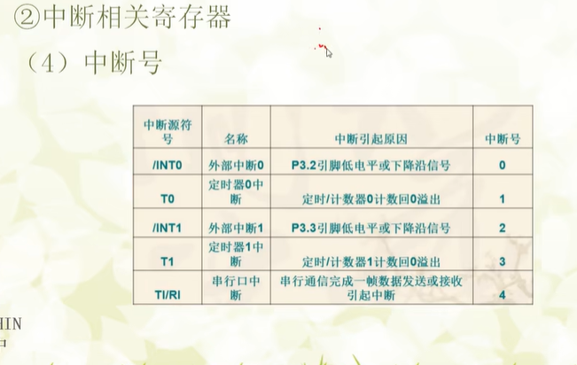
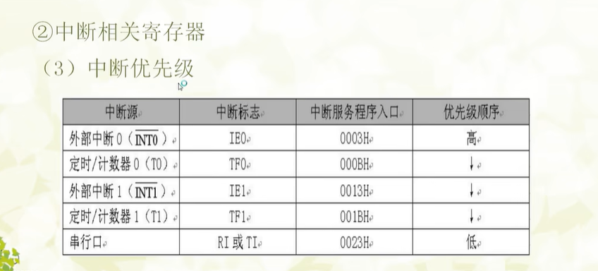
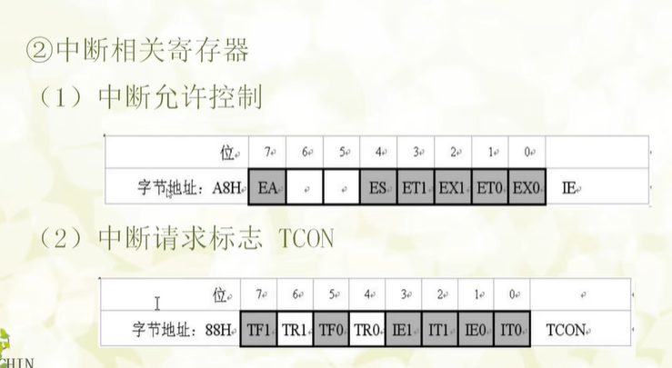
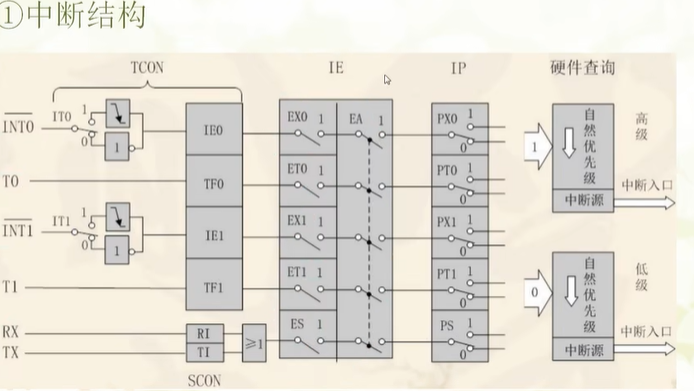
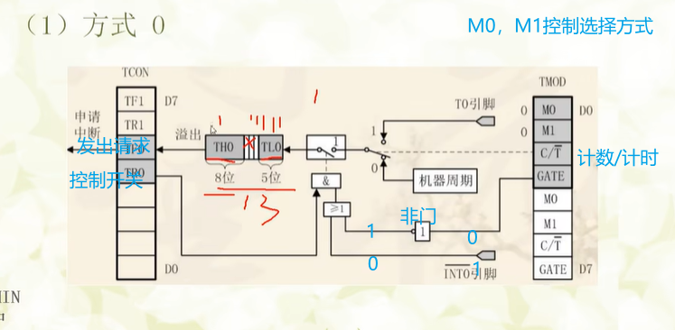

**外部中断**
```
#include <REGX52.H>
//#include <INTRINS.H>
#include"lcd1602.h"
#include"MatrixKey.h"
#include"Delay.h"
void exit0_init()
{
	IT0=1;
	EX0=1;
	EA=1;
}
void exit1_init()
{
	IT1=1;
	EX1=1;
	EA=1;
}
void main()
{
	exit0_init();
	while(1)
	{
		
	}
}
void exit0() interrupt 0
{
	Delay(100);
	if(P3_2==0)
	{
		P2_0=0;
	}
	else
	{
		P2_0=1;
	}
}
```

```
#include <REGX52.H>
//#include <INTRINS.H>
#include"lcd1602.h"
#include"MatrixKey.h"
#include"Delay.h"
#include<stdint.h>
void time0_init()
{
		TMOD|=0X01;
		TH0=0XFC;
		TL0=0X66;
		ET0=1;
		EA=1;
		TR0=1;
}
void main()
{
	time0_init();
	while(1)
	{
	}
}
void time0() interrupt 1
{
	static unsigned int i=0;
	TH0=0XFC;
	TL0=0X66;
	i++;
	if(i==1000)
	{
		i=0;
		P2_0=!P2_0;
	}
}
```