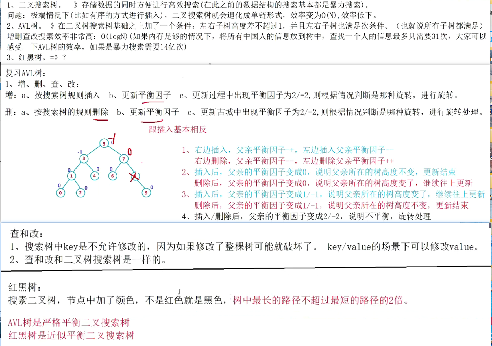

### 二叉搜索树

```
#pragma once
template<class K>
struct BSTreeNode
{
	BSTreeNode<K>* _left;
	BSTreeNode<K>* _right;

	K _key;
	BSTreeNode(const K& key)
		:_left(nullptr)
		,_right(nullptr)
		,_key(key)
	{

	}
};
template<class K>
class BSTree
{
	typedef BSTreeNode<K> Node;

public:
	bool Insert(const K& key)
	{
		if (_root == nullptr)
		{
			_root = new Node(key);
			return true;
		}
		Node* cur = _root;
		Node* parent = nullptr;
		while (cur)
		{
			if (cur->_key > key)
			{
				parent = cur;
				cur = cur->_left;
			}
			else if (cur->_key < key)
			{
				parent = cur;
				cur = cur->_right;
			}
			else
			{
				return false;
			}
		}
		cur = new Node(key);//这里容易有一个误区：以为cur指向的就是节点的下一个指针了，开辟完
		//就以为完事大吉，但实际上你去new了，你去堆区开辟一个空间，之前的cur都是局部变量
		//现在是指向堆区的一片空间，你需要与前面的节点建立链接啊
		if (parent->_key > key)
			parent->_left = cur;
		else parent->_right = cur;
		return true;
	}
	void _InOrder(Node* root)
	{
		if (root == nullptr)return;
		_InOrder(root->_left);
		cout << root->_key << " ";
		_InOrder(root->_right);
	}
	void InOrder()
	{
		_InOrder(_root);//如果不怎么写，就没办法传左孩子
		cout << endl;
	}
	bool find(const K& key)
	{
		Node* cur=_root;
		while (cur)
		{
			if (cur->_key > key)
			{
				cur = cur->_left;
			}
			else if (cur->_key < key)
			{
				cur = cur->_right;
			}
			else
			{
				return true;
			}
		}
		return false;
	}
	bool Erase(const K& key)
	{
		Node* parent = nullptr;
		Node* cur = _root;
		while (cur)
		{
			if (cur->_key < key)
			{
				parent = cur;
				cur = cur->_right;
			}
			else if (cur->_key > key)
			{
				parent = cur;
				cur = cur->_left;
			}
			else
			{
				
				if (cur->_left == nullptr)
				{
					if (parent == nullptr)
					{
						_root = cur->_right;  // 更新根节点
					}
					else
					{
						if (parent->_right == cur)
							parent->_right = cur->_right;
						else
							parent->_left = cur->_right;
						delete cur;
					}
				}
				else if (cur->_right == nullptr)
				{
					if (parent == nullptr)
					{
						_root = cur->_left;  // 更新根节点
					}
					else
					{
						if (parent->_left == cur)
							parent->_left = cur->_left;
						else
							parent->_right = cur->_left;
						delete cur;
					}
				}
				else
				{
					Node* rightMinparent = cur;//注意
					Node* rightMin = cur->_right;
					while (rightMin->_left)
					{
						rightMinparent = rightMin;
						rightMin = rightMin->_left;
					}
					cur->_key = rightMin->_key;

					if (rightMin == rightMinparent->_left)//注意
						rightMinparent->_left = rightMin->_right;
					else
						rightMinparent->_right = rightMin->_right;
					delete rightMin;
				}
				return true;
			}
		}
		return  false;
	}
private:
	Node* _root = nullptr;
};
```
- 搜索的使用场景
1. key模型---判断在不在
2. key/value模型---通过key找对应的value(中英字典互译/统计次数)

- 搜索的问题
- 搜索效率：如果插入的数据是有序或接近有序，那么搜索树效率就完全没办法保障
- 效率最坏的情况：O(n)
- 如何解决
1. AVLTree
2. 红黑树

### AVLTree
- AVLTree插入
    1. 搜素树的规则插入
    2. 更新平衡因子
    3. 如果出现了不平衡，调节

```
#pragma once


template<class K,class V>
struct AVTreeNode
{
	AVTreeNode<K, V>* _left;
	AVTreeNode<K, V>* _right;
	AVTreeNode<K, V>* _parent;
	int _bf;//平衡因子

	pair<K, V>_kv;
	AVTreeNode(const pair<K, V>& kv)
		:_left(nullptr)
		, _right(nullptr)
		, _parent(nullptr)
		, _kv(kv)
		, _bf(0)
	{

	}
};
template<class K,class V>
class AVLTree
{
	typedef AVTreeNode<K, V>Node;
public:
	bool Insert(const pair<K, V>& kv)
	{
		if (_root == nullptr)
		{
			_root = new Node(kv);
			return true;
		}
		Node* parent = nullptr;
		Node* cur = _root;
		while (cur)
		{
			if (cur->_kv.first > kv.first)
			{
				parent = cur;
				cur = cur->_left;
			}
			else if (cur->_kv.first < kv.first)
			{
				parent = cur;
				cur = cur->_right;
			}
			else
			{
				return false;
			}
		}
		cur = new Node(kv);
		if (parent->_kv.first < kv.first)
		{
			parent->_right = cur;
			cur->_parent = parent;
		}
		else
		{
			parent->_left = cur;
			cur->_parent = parent;
		}
		//更新平衡因子
		while (parent)
		{
			if (cur == parent->_right)
			{
				parent->_bf++;
			}
			else
			{
				parent->_bf--;
			}
			if (parent->_bf == 0)
			{
				//parent所在的子树高度不变，停止向上更新

				break;
			}
			else if (parent->_bf == 1 || parent->_bf == -1)
			{
				//parent所在的子树高度变了，继续向上更新
				cur = parent;
				parent = parent->_parent;
			}
			else if (parent->_bf == 2 || parent->_bf == -2)
			{
				//出现问题
				//旋转的前提
				//1.报仇它依旧是搜索二叉树
				//2.旋转成平衡树
				if (parent->_bf == 2)
				{
					if (cur->_bf == 1)
					{
						RotateL(parent);
					}
					else if (cur->_bf == -1)
					{
						RotateRL(parent);
					}
				}
				else if (parent->_bf == -2)
				{
					if (cur->_bf == -1)
					{
						RotateR(parent);
					}
					else if (cur->_bf == 1)
					{
						RotateLR(parent);
					}
				}
				//旋转完成后，parent所在树的高度恢复到了插入节点前高度
				break;
			}
		}
		return true;
	}
	void RotateL(Node* parent)
	{
		Node* subR = parent->_right;
		Node* subRL = subR->_left;

		parent->_right = subRL;
		if (subRL)
			subRL->_parent = parent;
		subR->_left = parent;
		Node* ppNode = parent->_parent;
		parent->_parent = subR;
		if (_root == parent)
		{
			_root = subR;
			subR->_parent = nullptr;
		}
		else
		{
			if (ppNode->_left == parent)
				ppNode->_left = subR;
			else
				ppNode->_right = subR;
			subR->_parent = ppNode;
		}
		parent->_bf = subR->_bf = 0;
	}
	void RotateR(Node* parent)
	{
		Node* subL = parent->_left;
		Node* subLR = subL->_right;
		parent->_left = subLR;
		if (subLR)
			subLR->_parent = parent;
		subL->_right = parent;
		Node* ppNode = parent->_parent;
		parent->_parent = subL;

		if (_root == parent)
		{
			_root = subL;
			subL->_parent = nullptr;
		}
		else
		{
			if (ppNode->_left == parent)
				ppNode->_left = subL;
			else
				ppNode->_right = subL;
			subL->_parent = ppNode;
		}
		subL->_bf = parent->_bf = 0;

	}
	void RotateRL(Node* parent)
	{

		Node* subR = parent->_right;
		Node* subRL = subR->_left;
		int bf = subRL->_bf;

		RotateR(parent->_right);
		RotateL(parent);

		if (bf == -1)
		{
			parent->_bf = 0;
			subR->_bf = 1;
			subRL->_bf = 0;
		}
		else if (bf == 1)
		{
			subR->_bf = 0;
			parent->_bf = -1;
			subRL->_bf = 0;
		}
		else if (bf == 0)
		{
			subR->_bf = 0;
			parent->_bf = 0;
			subRL->_bf = 0;
		}
	}
	void RotateLR(Node* parent)
	{
		Node* subL = parent->_left;
		Node* subLR = subL->_right;
		int bf = subLR->_bf;

		RotateL(subL);
		RotateR(parent);
		if (bf == 1)
		{
			parent->_bf = 0;
			subL->_bf = -1;
			subLR->_bf = 0;
		}
		else if (bf == -1)
		{
			parent->_bf = 1;
			subL->_bf =0;
			subLR->_bf = 0;
		}
		else if (bf == 0)
		{
			parent->_bf = 0;
			subL->_bf = 0;
			subLR->_bf = 0;
		}
	}
	void _InOrder(Node* root)
	{
		if (root == nullptr)return;
		_InOrder(root->_left);
		cout << root->_kv.first << ":" << root->_kv.second << endl;
		_InOrder(root->_right);
	}
	void InOrder()
	{
		_InOrder(_root);//如果不怎么写，就没办法传左孩子
		cout << endl;
	}
	bool _IsBalance(Node* root)
	{
		if (root == nullptr)
		{
			return true;
		}
		int leftHeight = Height(root->_left);
		int rightHeight = Height(root->_right);

		return abs(leftHeight - rightHeight) < 2
			&& _IsBalance(root->_left)
			&& _IsBalance(root->_right);
	}
	bool IsBalance()
	{
		return _IsBalance(_root);
	}
	int Height(Node* root)
	{
		if (root == nullptr)return 0;
		int leftHeight = Height(root->_left);
		int rightHeight = Height(root->_right);
		return (leftHeight > rightHeight ? leftHeight : rightHeight) + 1;
	}
private:
	Node* _root = nullptr;
};

```




### RBTree
```
#pragma once
enum Colour{RED,BLACK};
template<class K,class V>
struct RBTreeNode
{
	RBTreeNode<K, V>* _left;
	RBTreeNode<K, V>* _right;
	RBTreeNode<K, V>* _parent;

	pair<K, V> _kv;
	Colour _col;
	RBTreeNode(const pair<K, V>& kv)
		:_left(nullptr)
		,_right(nullptr)
		,_parent(nullptr)
		,_kv(kv)
		,_col(RED)
	{

	}
};

template<class K,class V>
class RBTree
{
	typedef RBTreeNode<K, V> Node;
public:
	bool Insert(const pair<K, V>& kv)
	{
		if (_root == nullptr)
		{
			_root = new Node(kv);
			_root->_col = BLACK;
			return true;
		}
		Node* parent = nullptr;
		Node* cur = _root;
		while (cur)
		{
			if (cur->_kv.first < kv.first)
			{
				parent = cur;
				cur = cur->_right;

			}
			else if (cur->_kv.first > kv.first)
			{
				parent = cur;
				cur = cur->_left;
			}
			else
			{
				return false;
			}
		}
		cur = new Node(kv);
		if (parent->_kv.first < kv.first)
		{
			parent->_right = cur;
			cur->_parent = parent;
		}
		else
		{
			parent->_left = cur;
			cur->_parent = parent;
		}

		cur->_col = RED;
		while (parent&&parent->_col == RED)
		{
			Node* grandfather = parent->_parent;
			if (grandfather->_left == parent)
			{
				Node* uncle = grandfather->_right;
				if (uncle && uncle->_col == RED)
				{
					parent->_col = uncle->_col = BLACK;
					grandfather->_col = RED;

					cur = grandfather;
					parent = cur->_parent;
				}
				else
				{
					if (cur == parent->_right)
					{
						RotateL(parent);
						swap(parent, cur);
					}

					RotateR(grandfather);
					grandfather->_col = RED;
					parent->_col = BLACK;

					break;
				}
			}
			else
			{
				Node* uncle = grandfather->_left;
				if (uncle && uncle->_col == RED)
				{
					parent->_col = uncle->_col = BLACK;
					grandfather->_col = RED;
					cur = grandfather;
					parent = cur->_parent;

				}
				else
				{
					if (cur == parent->_left)
					{
						RotateR(parent);
						swap(parent, cur);

					}
					RotateL(grandfather);
					grandfather->_col = RED;
					parent->_col = BLACK;
					break;
				}

			}
			
		}
		_root->_col = BLACK;
		return true;
	}
	void RotateL(Node* parent)
	{
		Node* subR = parent->_right;
		Node* subRL = subR->_left;

		parent->_right = subRL;
		if (subRL)
			subRL->_parent = parent;
		subR->_left = parent;
		Node* ppNode = parent->_parent;
		parent->_parent = subR;
		if (_root == parent)
		{
			_root = subR;
			subR->_parent = nullptr;
		}
		else
		{
			if (ppNode->_left == parent)
				ppNode->_left = subR;
			else
				ppNode->_right = subR;
			subR->_parent = ppNode;
		}

	}
	void RotateR(Node* parent)
	{
		Node* subL = parent->_left;
		Node* subLR = subL->_right;
		parent->_left = subLR;
		if (subLR)
			subLR->_parent = parent;
		subL->_right = parent;
		Node* ppNode = parent->_parent;
		parent->_parent = subL;

		if (_root == parent)
		{
			_root = subL;
			subL->_parent = nullptr;
		}
		else
		{
			if (ppNode->_left == parent)
				ppNode->_left = subL;
			else
				ppNode->_right = subL;
			subL->_parent = ppNode;
		}

	}
	void _InOrder(Node* root)
	{
		if (root == nullptr)return;
		_InOrder(root->_left);
		cout << root->_kv.first << ":" << root->_kv.second << endl;
		_InOrder(root->_right);
	}
	void InOrder()
	{
		_InOrder(_root);//如果不怎么写，就没办法传左孩子
		cout << endl;
	}
	bool IsValidRBTree()
	{
		if (_root == nullptr)
			return true;

		if (_root->_col == RED)
		{
			cout << "违反性质2：根节点不是黑色" << endl;
			return false;
		}

		// 获取任意一条路径的黑色节点数量作为基准
		int blackCount = 0;
		Node* cur = _root;
		while (cur)
		{
			if (cur->_col == BLACK)
				blackCount++;
			cur = cur->_left;
		}

		return _IsValidRBTree(_root, 0, blackCount);
	}
	bool _IsValidRBTree(Node* root, int pathBlackCount, int baseBlackCount)
	{
		if (root == nullptr)
		{
			// 到达叶子节点，检查黑色节点数量
			if (pathBlackCount != baseBlackCount)
			{
				cout << "违反性质5：路径黑色节点数量不同" << endl;
				return false;
			}
			return true;
		}

		// 检查性质4：不能有连续的红色节点
		if (root->_col == RED && root->_parent && root->_parent->_col == RED)
		{
			cout << "违反性质4：存在连续红色节点" << endl;
			return false;
		}

		// 更新路径黑色节点数量
		int newBlackCount = pathBlackCount;
		if (root->_col == BLACK)
			newBlackCount++;

		// 递归检查左右子树
		return _IsValidRBTree(root->_left, newBlackCount, baseBlackCount) &&
			_IsValidRBTree(root->_right, newBlackCount, baseBlackCount);
	}
private:
	Node* _root = nullptr;
};
```


```
#pragma once
#include"RBTree.h"
namespace zc
{
	template<class K>
	class set
	{
	public:
		struct SetKeyOfT
		{
			const K& operator()(const K& k)
			{
				return k;
			}
		};
		typedef typename RBTree<K, K, SetKeyOfT>::iterator iterator;
		iterator begin()
		{
			return _t.begin();
		}
		iterator end()
		{
			return _t.end();
		}
		bool Insert(const K&k)
		{
			return _t.Insert(k);
		}
	private:
		RBTree<K, K, SetKeyOfT> _t;
	};
	void test2()
	{
		set<int>s;
		s.Insert(3);
		s.Insert(1);
		s.Insert(10);
		s.Insert(1434);
		s.Insert(134);
		s.Insert(167);
		s.Insert(125);
		set<int>::iterator it = s.begin();
		while (it != s.end())
		{
			cout << *it << " ";
			++it;
		}
		cout << endl;
	}
}
```

```
#pragma once
#include"RBTree.h"
namespace zc
{
	template<class K, class V>
	class map
	{
	public:
		struct MapKeyOfT
		{
			const K& operator()(const pair<K, V>& kv)
			{
				return kv.first;
			}
		};
		bool Insert(const pair<K, V>& kv)
		{
			return _t.Insert(kv);
		}
		typedef typename RBTree<K, pair<K,V>, MapKeyOfT>::iterator iterator;
		iterator begin()
		{
			return _t.begin();
		}
		iterator end()
		{
			return _t.end();
		}
	private:
		RBTree<K, pair<K, V>, MapKeyOfT> _t;
	};
	void test()
	{
		map<int, int>m;
		m.Insert(make_pair(1, 1));
		m.Insert(make_pair(3, 3));
		m.Insert(make_pair(343, 343));
		m.Insert(make_pair(36, 36));
		m.Insert(make_pair(377, 377));
		m.Insert(make_pair(637, 637));
		map<int, int>::iterator it = m.begin();
		while (it != m.end())
		{
			cout << it->first << " " << it->second << endl;
			++it;
		}
		cout << endl;
	}
}
```
### 模拟实现map和set
```
#pragma once
enum Colour{RED,BLACK};
template<class T>
struct RBTreeNode
{
	RBTreeNode<T>* _left;
	RBTreeNode<T>* _right;
	RBTreeNode<T>* _parent;

	T _data;
	Colour _col;
	RBTreeNode(const T& data)
		:_left(nullptr)
		,_right(nullptr)
		,_parent(nullptr)
		,_data(data)
		,_col(RED)
	{

	}
};
template<class T,class Ref,class Ptr>
struct __TreeIterator
{
	typedef RBTreeNode<T> Node;
	typedef __TreeIterator<T,Ref,Ptr> Self;
	Node* _node;
	__TreeIterator(Node* node):_node(node)
	{

	}
	Ref operator*()
	{
		return _node->_data;
	}
	Ptr operator->()
	{
		return &_node->_data;
	}
	Self& operator++()
	{
		if (_node->_right)
		{
			Node* subLeft = _node->_right;
			while (subLeft->_left)
			{
				subLeft = subLeft->_left;
			}
			_node = subLeft;
		}
		else
		{
			Node* cur = _node;
			Node* parent = cur->_parent;
			while (parent && cur == parent->_right)
			{
				cur = cur->_parent;
				parent = parent->_parent;
			}
			_node = parent;
		}
		return *this;
	}

	Self& operator--()
	{
		return *this;
	}
	bool  operator!=(const Self& s)
	{
		return _node != s._node;
	}
};
template<class K,class T,class KOFT>
class RBTree
{
	
public:
	typedef RBTreeNode<T> Node;
	typedef __TreeIterator<T, T&, T*>iterator;
	typedef __TreeIterator<T,const T&,const T*>const_iterator;
	iterator begin()
	{
		Node* cur = _root;
		while (cur && cur->_left)cur = cur->_left;
		return iterator(cur);
	}
	iterator end()
	{
		return iterator(nullptr);
	}
	bool Insert(const T& data)
	{
		if (_root == nullptr)
		{
			_root = new Node(data);
			_root->_col = BLACK;
			return true;
		}
		KOFT koft;

		Node* parent = nullptr;
		Node* cur = _root;
		while (cur)
		{
			if (koft(cur->_data) < koft(data))
			{
				parent = cur;
				cur = cur->_right;

			}
			else if (koft(cur->_data) > koft(data))
			{
				parent = cur;
				cur = cur->_left;
			}
			else
			{
				return false;
			}
		}
		cur = new Node(data);
		if (koft(parent->_data) < koft(cur->_data))
		{
			parent->_right = cur;
			cur->_parent = parent;
		}
		else
		{
			parent->_left = cur;
			cur->_parent = parent;
		}

		cur->_col = RED;
		while (parent&&parent->_col == RED)
		{
			Node* grandfather = parent->_parent;
			if (grandfather->_left == parent)
			{
				Node* uncle = grandfather->_right;
				if (uncle && uncle->_col == RED)
				{
					parent->_col = uncle->_col = BLACK;
					grandfather->_col = RED;

					cur = grandfather;
					parent = cur->_parent;
				}
				else
				{
					if (cur == parent->_right)
					{
						RotateL(parent);
						swap(parent, cur);
					}

					RotateR(grandfather);
					grandfather->_col = RED;
					parent->_col = BLACK;

					break;
				}
			}
			else
			{
				Node* uncle = grandfather->_left;
				if (uncle && uncle->_col == RED)
				{
					parent->_col = uncle->_col = BLACK;
					grandfather->_col = RED;
					cur = grandfather;
					parent = cur->_parent;

				}
				else
				{
					if (cur == parent->_left)
					{
						RotateR(parent);
						swap(parent, cur);

					}
					RotateL(grandfather);
					grandfather->_col = RED;
					parent->_col = BLACK;
					break;
				}

			}
			
		}
		_root->_col = BLACK;
		return true;
	}
	void RotateL(Node* parent)
	{
		Node* subR = parent->_right;
		Node* subRL = subR->_left;

		parent->_right = subRL;
		if (subRL)
			subRL->_parent = parent;
		subR->_left = parent;
		Node* ppNode = parent->_parent;
		parent->_parent = subR;
		if (_root == parent)
		{
			_root = subR;
			subR->_parent = nullptr;
		}
		else
		{
			if (ppNode->_left == parent)
				ppNode->_left = subR;
			else
				ppNode->_right = subR;
			subR->_parent = ppNode;
		}

	}
	void RotateR(Node* parent)
	{
		Node* subL = parent->_left;
		Node* subLR = subL->_right;
		parent->_left = subLR;
		if (subLR)
			subLR->_parent = parent;
		subL->_right = parent;
		Node* ppNode = parent->_parent;
		parent->_parent = subL;

		if (_root == parent)
		{
			_root = subL;
			subL->_parent = nullptr;
		}
		else
		{
			if (ppNode->_left == parent)
				ppNode->_left = subL;
			else
				ppNode->_right = subL;
			subL->_parent = ppNode;
		}

	}
	void _InOrder(Node* root)
	{
		if (root == nullptr)return;
		_InOrder(root->_left);
		//cout << root->_data << ":" << root->_kv.second << endl;
		_InOrder(root->_right);
	}
	void InOrder()
	{
		_InOrder(_root);//如果不怎么写，就没办法传左孩子
		cout << endl;
	}
	bool IsValidRBTree()
	{
		if (_root == nullptr)
			return true;

		if (_root->_col == RED)
		{
			cout << "违反性质2：根节点不是黑色" << endl;
			return false;
		}

		// 获取任意一条路径的黑色节点数量作为基准
		int blackCount = 0;
		Node* cur = _root;
		while (cur)
		{
			if (cur->_col == BLACK)
				blackCount++;
			cur = cur->_left;
		}

		return _IsValidRBTree(_root, 0, blackCount);
	}
	bool _IsValidRBTree(Node* root, int pathBlackCount, int baseBlackCount)
	{
		if (root == nullptr)
		{
			// 到达叶子节点，检查黑色节点数量
			if (pathBlackCount != baseBlackCount)
			{
				cout << "违反性质5：路径黑色节点数量不同" << endl;
				return false;
			}
			return true;
		}

		// 检查性质4：不能有连续的红色节点
		if (root->_col == RED && root->_parent && root->_parent->_col == RED)
		{
			cout << "违反性质4：存在连续红色节点" << endl;
			return false;
		}

		// 更新路径黑色节点数量
		int newBlackCount = pathBlackCount;
		if (root->_col == BLACK)
			newBlackCount++;

		// 递归检查左右子树
		return _IsValidRBTree(root->_left, newBlackCount, baseBlackCount) &&
			_IsValidRBTree(root->_right, newBlackCount, baseBlackCount);
	}
private:
	Node* _root = nullptr;
};
```