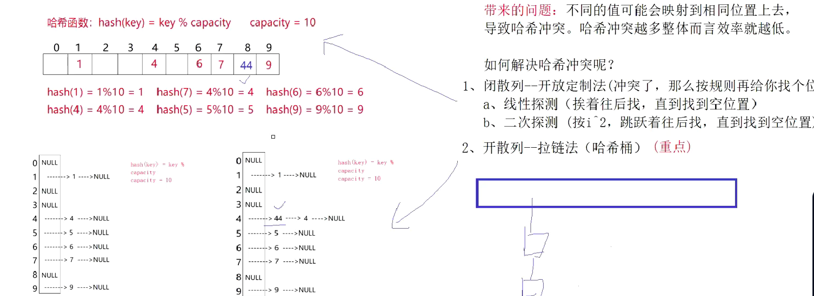

## 哈希

### unordered_map unordered_set的使用
```
#include<iostream>
#include<unordered_map>
#include<unordered_set>
using namespace std;

int main()
{
	unordered_set<int>us;;//可以去重，但不能排序，不能修改
	us.insert(2);
	us.insert(266);
	us.insert(235);
	us.insert(2);
	us.insert(34);
	us.insert(22);
	unordered_set<int>::iterator it = us.begin();
	while (it != us.end())
	{
		cout << *it << " ";
		it++;
	}
	cout << endl;

	unordered_map<string, string>dict;
	dict.insert(make_pair("string", "字符串"));
	dict.insert(make_pair("insert", "插入"));
	dict.insert(make_pair("left", "左边"));
	for (auto e : dict)
	{
		cout << e.first << " " << e.second << endl;
	}
	return 0;
}
```

- map/set和它们两有什么区别和联系
    1. 都可以实现key和key/value的搜索场景，并且功能和使用基本一样
    2. map和set的底层是使用红黑树，遍历出来是有序的，增删查改的时间复杂度是O(logn)
    3. unordered_map和unordered_set的底层都是使用哈希表实现的，遍历出来是无序的，增删查改的时间复杂度是O(1)
    4. map和set都是双向迭代器，unordered_map和unordered_set是单向迭代器

- resize:开空间+初始化
- reserve：开空间


- 之前我们对哈希的使用
    1. 直接定制法（映射只跟关键字直接或间接相关）
    2. 除留余数法

- 搜索树取决于树的高度，也就是说数据量越大效率会降低
- 哈希通过映射关系直接进行查找，效率非常高，哈希最大的问题是如何解决哈希冲突问题




### 模拟实现

```
#pragma once
#include<vector>
enum State
{
	EMPTY,
	EXITS,
	DELETE,
};
template<class T>
struct HashData
{
	T _data;
	State _state;
};


template<class K,class T,class KeyOfT>
class HashTable
{
	typedef HashData<T> HashData;
public:
	bool Insert(const T& d)
	{
		KeyOfT koft;

		//负载因子=表中数据/表的大小  衡量哈希表满的程度
		//表越接近满，插入数据就越容易冲突
		//一般到0.7就要增容
		//负载因子越小，冲突概率越大，但越小也意味着浪费空间越大
		//所以负载因子要取一个折中
		<!-- if (_tables.size()==0||_num *10 / _tables.size() >= 7)
		{
			vector<HashData>newtables;
			size_t newsize = _tables.size() == 0 ? 10 : _tables.size() * 2;
			newtables.resize(newsize);
			for (size_t i = 0; i < _tables.size(); i++)
			{
				if (_tables[i]._state == EXITS)
				{
					size_t index = koft(_tables[i]._data) % newtables.size();
					while (newtables[index]._state == EXITS)
					{
						index++;
						if (index == _tables.size())
						{
							index = 0;
						}
					}
					newtables[index] = _tables[i];
				}
			}
			_tables.swap(newtables);
		} -->
        if (_tables.size()==0||_num *10 / _tables.size() >= 7)
        {

            HashTable<K, T, KeyOfT> newht;
            size_t newsize = _tables.size() == 0 ? 10 : _tables.size() * 2;
            newht._tables.resize(newsize);
            for (size_t i = 0; i < _tables.size(); i++)
            {
                if (_tables[i]._state == EXITS)
                {
                    newht.Insert(_tables[i]._data);//改成这样就是为了能复用insert
                }
            }
            _tables.swap(newht._tables);


        }
		size_t index = koft(d) % _tables.size();
		while (_tables[index]._state == EXITS)
		{
			if (koft(_tables[index]._data) == koft(d))
			{
				return false;
			}
			++index;
			if (index == _tables.size())index = 0;
		}
		_tables[index]._data = d;
		_tables[index]._state = EXITS;
		_num++;
		return true;
        //二次探索
        <!-- size_t start = koft(d) % _tables.size();
        size_t index = start;
        int i = 1;
        while (_tables[index]._state == EXITS)
        {
            if (koft(_tables[index]._data) == koft(d))
            {
                return false;
            }
            index = start + i * i;
            index %= _tables.size();

        }
        _tables[index]._data = d;
        _tables[index]._state = EXITS;
        _num++;
        return true; -->
	}
	HashData* Find(const K& key)
	{
		KeyOfT koft;

		size_t index = key % _tables.sizee();
		while (_tables[index]._state != EMPTY)
		{
			if (koft(_tables[index]._data) == key)
			{
				if (_tables[index]._state == EXITS)
					return &_tables[index];
				else
					return nullptr;
			}
			index++;
			if (index == _tables.size())
			{
				index = 0;
			}
		}
		return nullptr;
	}
	bool Erase(const K& key)
	{
		HashData* ret = Find(key);
		if (ret)
		{
			ret->_state = DELETE;
			_num--;
			return true;
		}
		else
		{
			return false;
		}
	}
private:
	vector<HashData> _tables;
	size_t _num;
};
```

- 闲散列线性探测的问题：可能会导致一片一片的冲突，洪水效应
- 二次探测：更加分散，不会聚集在一起，形成连片冲突
- 但都不是很好的解决方式

- 哈希桶


- unordered_map和unordered_set的模拟实现


```
#pragma once
#include<vector>
//enum State
//{
//	EMPTY,
//	EXITS,
//	DELETE,
//};
//template<class T>
//struct HashData
//{
//	T _data;
//	State _state;
//};
//
//
//template<class K,class T,class KeyOfT>
//class HashTable
//{
//	typedef HashData<T> HashData;
//public:
//	bool Insert(const T& d)
//	{
//		KeyOfT koft;
//
//		if (_tables.size() == 0 || _num * 10 / _tables.size() >= 7)
//		{
//
//			HashTable<K, T, KeyOfT> newht;
//			size_t newsize = _tables.size() == 0 ? 10 : _tables.size() * 2;
//			newht._tables.resize(newsize);
//			for (size_t i = 0; i < _tables.size(); i++)
//			{
//				if (_tables[i]._state == EXITS)
//				{
//					newht.Insert(_tables[i]._data);//改成这样就是为了能复用insert
//				}
//			}
//			_tables.swap(newht._tables);
//
//
//		}
//		
//		size_t start = koft(d) % _tables.size();
//		size_t index = start;
//		int i = 1;
//		while (_tables[index]._state == EXITS)
//		{
//			if (koft(_tables[index]._data) == koft(d))
//			{
//				return false;
//			}
//			index = start + i * i;
//			index %= _tables.size();
//		
//		}
//		_tables[index]._data = d;
//		_tables[index]._state = EXITS;
//		_num++;
//		return true;
//	}
//	HashData* Find(const K& key)
//	{
//		KeyOfT koft;
//
//		size_t index = key % _tables.sizee();
//		while (_tables[index]._state != EMPTY)
//		{
//			if (koft(_tables[index]._data) == key)
//			{
//				if (_tables[index]._state == EXITS)
//					return &_tables[index];
//				else
//					return nullptr;
//			}
//			index++;
//			if (index == _tables.size())
//			{
//				index = 0;
//			}
//		}
//		return nullptr;
//	}
//	bool Erase(const K& key)
//	{
//		HashData* ret = Find(key);
//		if (ret)
//		{
//			ret->_state = DELETE;
//			_num--;
//			return true;
//		}
//		else
//		{
//			return false;
//		}
//	}
//private:
//	vector<HashData> _tables;
//	size_t _num;
//};


#include<string>
#include <string>
namespace OPEN_HASH
{

	template<class T>
	struct HashNode
	{
		T _data;
		HashNode<T>* _next;
		HashNode(const T& data)
			:_data(data)
			,_next(nullptr)
		{

		}
	};

	template<class K, class T, class KeyOfT, class Hash>
	class HashTable;


	template<class K, class T, class KeyOfT,class Hash>
	struct _HashTableIterator
	{
		typedef HashNode<T> Node;
		typedef _HashTableIterator<K, T, KeyOfT,Hash> Self;
		typedef HashTable<K, T, KeyOfT, Hash> HT;
		Node* _node;
		HT* _pht;
		_HashTableIterator(Node* node,HT* pht)
			:_node(node)
			,_pht(pht)
		{}
		T& operator*()
		{
			return _node->_data;
		}
		T* operator->()
		{
			return &_node->_data;
		}
		Self operator++()
		{
			if (_node->_next)
			{
				_node = _node->_next;
				return *this;

			}
			else
			{
				KeyOfT koft;
				size_t i = _pht->HashFunc(koft(_node->_data)) % _pht->_tables.size();
				++i;
				for (; i < _pht->_tables.size(); i++)
				{
					Node* cur = _pht->_tables[i];
					if (cur)
					{
						_node = cur;
						return *this;
					}
				}
				_node = nullptr;
				return *this;

			}

		}
		bool operator!=(const Self& s)
		{
			return _node != s._node;
		}
	};

	template<class K,class T,class KeyOfT,class Hash>
	class HashTable
	{
		friend struct _HashTableIterator<K, T, KeyOfT, Hash>;
	public:
		typedef _HashTableIterator<K, T, KeyOfT,Hash> iterator;

		typedef HashNode<T> Node;
		~HashTable()
		{
			clear();
		}
		iterator begin()
		{
			for (size_t i = 0; i < _tables.size(); i++)
			{
				if (_tables[i])
				{
					return iterator(_tables[i],this);
				}
			}
			return end();
		}

		iterator end()
		{
			return iterator(nullptr,this);
		}
		void clear()
		{
			for (size_t i = 0; i < _tables.size(); i++)
			{
				Node* cur = _tables[i];
				while (cur)
				{
					Node* next = cur->_next;
					delete cur;
					cur = next;
				}
				_tables[i] = nullptr;
			}
		}
		size_t HashFunc(const K& key)
		{
			Hash hash;
			return hash(key);
		}
		pair<iterator,bool> Insert(const T& data)
		{
			KeyOfT koft;

			if (_tables.size() == _num)
			{
				vector<Node*> newtables;
				size_t newsize = _tables.size() == 0 ? 10 : _tables.size() * 2;
				newtables.resize(newsize);
				for (size_t i = 0; i < _tables.size(); i++)
				{
					Node* cur = _tables[i];
					while (cur)
					{
						Node* next = cur->_next;
						size_t index = HashFunc(koft(cur->_data)) % newtables.size();
						cur->_next = newtables[index];
						newtables[index] = cur;
						cur = next;
					}
					_tables[i] = nullptr;
				}
				_tables.swap(newtables);
			}


			size_t index = HashFunc(koft(data)) %_tables.size();
			Node* cur = _tables[index];
			while (cur)
			{
				if (HashFunc(koft(cur->_data)) == HashFunc(koft(data)))
				{
					return make_pair(iterator(cur, this), false);
				}
				else
				{
					cur = cur->_next;
				}
			}
			Node* newnode = new Node(data);
			newnode->_next = _tables[index];   
			_tables[index] = newnode;

			++_num;
			return 	make_pair(iterator(newnode, this), false);

		}
		Node* Find(const K& key)
		{
			KeyOfT koft;
			size_t index = key % _tables.size();
			Node* cur = _tables[index];
			while (cur)
			{
				if (HashFunc(koft(cur->_data)) == key)
				{
					return cur;

				}
				else
				{
					cur = cur->_next;
				}
			}
			return nullptr;
		}
		bool Erase(const K& key)
		{
			KeyOfT koft;
			size_t index = key % _tables.size();
			Node* prev = nullptr;
			Node* cur = _tables[index];
			while (cur)
			{
				if (HashFunc(koft(cur->_data)) == key)
				{
					if (prev == nullptr)
					{
						_tables[index] = cur->_next;
					}
					else
					{

						prev->_next = cur->_next;
						delete cur;
						return true;
					}

				}
				else
				{
					prev = cur;
					cur = cur->_next;
				}
			}
			return false;

		}
	private:
		vector<Node*>_tables;
		size_t _num=0;
	};
	/*template<class K>
	struct SetKeyOfT
	{
		const K& operator()(const K& key)
		{
			return key;
		}
	};*/
	//
}
```

```
#pragma once

#include"HashTable.h"
using namespace OPEN_HASH;
namespace zzcc
{
	template<class K>
	struct _Hash
	{
		const K& operator()(const K& key)
		{
			return key;
		}
	};
	//模板的特化
	template<>
	struct _Hash<string>
	{
		size_t operator()(const string& key)
		{
			size_t hash = 0;
			for (size_t i = 0; i < key.size(); i++)
				hash += key[i];
			return hash;
		}
	};
	template<class K,class hash=_Hash<K>>
	class unordered_set
	{
	public:
		struct SetKOFT
		{
			const K& operator()(const K& k)
			{
				return k;
			}
		};
		typedef typename HashTable<K, K, SetKOFT, hash>::iterator iterator;//因为它还没实例化
		pair<iterator,bool> insert(const K& k)
		{
			return _ht.Insert(k);
		}
		iterator begin()
		{
			return _ht.begin();
		}
		iterator end()
		{
			return _ht.end();
		}
		
		
	private:
		OPEN_HASH::HashTable<K, K, SetKOFT,hash>_ht;
	};
	void test3()
	{
		unordered_set<int>s;
		s.insert(1);
		s.insert(99);
		s.insert(10);
		s.insert(3);
		unordered_set<int>::iterator it = s.begin();
		while (it != s.end())
		{
			cout << *it << " ";
			++it;
		}
		cout << endl;
	}
}
```

```
#pragma once
#include"HashTable.h"
using namespace OPEN_HASH;

namespace zzc
{
	template<class K>
	struct _Hash
	{
		const K& operator()(const K& key)
		{
			return key;
		}
	};
	//模板的特化
	template<>
	struct _Hash<string>
	{
		size_t operator()(const string& key)
		{
			size_t hash = 0;
			for (size_t i = 0; i < key.size(); i++)
				hash += key[i];
			return hash;
		}
	};
	template<class K, class V,class hash=_Hash<K>>
	class unordered_map
	{
	public:
		struct MapKOFT
		{
			const K& operator()(const pair<K, V>& kv)
			{
				return kv.first;
			}
		};
		typedef typename HashTable<K,pair<K,V>, MapKOFT, hash>::iterator iterator;//因为它还没实例化
		pair<iterator,bool> insert(const pair<K,V>& kv)
		{
			return _ht.Insert(kv);
		}
		iterator begin()
		{
			return _ht.begin();
		}
		iterator end()
		{
			return _ht.end();
		}
		V& operator[](const K& key)
		{
			pair<iterator, bool>ret = _ht.Insert(make_pair(key, V()));
			return ret.first->second;
		}
	private:
		OPEN_HASH::HashTable<K, pair<K, V>, MapKOFT,hash>_ht;
	};

	void test4()
	{
		unordered_map<string, string>dict;
		dict.insert(make_pair("sort", "排序"));
		dict.insert(make_pair("left", "左边"));
		dict.insert(make_pair("right", "右边"));
		dict["right"] = "左边";
		unordered_map<string,string>::iterator it = dict.begin();

		while (it != dict.end())
		{
			cout << it->first << " "<<it->second<<endl;//为啥这里报错了
			++it;
		}
		cout << endl;
	}
}
```

### 位图

```
#pragma once
#include<vector>

namespace ttt
{
	class bitset
	{
	public:
		bitset(size_t N)
		{
			_bits.resize(N / 32 + 1, 0);
			_num = 0;
		}
		void set(size_t x)
		{
			size_t index = x / 32;
			size_t pos = x % 32;

			_bits[index] |= (1 << pos);
		}
		void reset(size_t x)
		{
			size_t index = x / 32;
			size_t pos = x % 32;

			_bits[index] &= ~(1 << pos);
		}
		bool test(size_t x)
		{
			size_t index = x / 32;
			size_t pos = x % 32;

			return _bits[index] & (1 << pos);
		}
		
	private:
		std::vector<int>_bits;
		int _num;
	};
	void test_bits()
	{
		bitset bs(100);
		bs.set(2);
		bs.set(99);
		for (size_t i = 0; i < 100; i++)
		{
			cout << bs.test(i);
		}

	}
}
```

### 布隆过滤器
- 哈希表：浪费空间
- 位图：只能存整数
- 布隆过滤器：两者结合

```
#pragma once
#include"bitset.h"
#include<string>
namespace hahaha
{
	struct HashStr1
	{
		size_t operator()(const std::string& str)
		{
			size_t hash = 0;
			for (size_t i = 0; i < str.size(); i++)
			{
				hash *= 131;
				hash += str[i];
			}
			return hash;
		}
	};
	struct HashStr2
	{
		size_t operator()(const std::string& str)
		{
			size_t hash = 0;
			size_t magic = 63689;
			for (size_t i = 0; i < str.size(); i++)
			{
				hash *= magic;
				hash += str[i];
				magic *= 378551;
			}
			return hash;
		}
	};
	struct HashStr3
	{
		size_t operator()(const std::string& str)
		{
			size_t hash = 0;
			for (size_t i = 0; i < str.size(); i++)
			{
				hash *= 65599;
				hash += str[i];
			}
			return hash;
		}
	};
	template<class K=std::string,class Hash1= HashStr1,class Hash2=HashStr2,class Hash3=HashStr3>
	class bloomfilter
	{
	public:
		bloomfilter(size_t num)
			:_bs(5*num)
			,_N(5*num)
		{

		}
		void set(const K& key)
		{
			size_t index1 = Hash1()(key) % _N;;
			size_t index2 = Hash2()(key) % _N;;
			size_t index3 = Hash3()(key) % _N;;

			_bs.set(index1);
			_bs.set(index2);
			_bs.set(index3);
		}

		bool test(const K& key)
		{
			size_t index1 = Hash1()(key) % _N;;
			if (_bs.test(index1) == false)
			{
				return false;
			}

			size_t index2 = Hash2()(key) % _N;;
			if (_bs.test(index2) == false)
			{
				return false;
			}
			size_t index3 = Hash3()(key) % _N;;
			if (_bs.test(index3) == false)
			{
				return false;
			}
			return true;//不管如何还是存在误判
		}
		//布隆过滤器不支持删除
		/*void reset(const K& key)
		{

		}*/
	private:
		ttt::bitset _bs;
		size_t _N;
	};
	void test_bllomfilter()
	{
		bloomfilter<string>bf(100);
		bf.set("121223423");
		bf.set("22341");
		bf.set("wihnewh");
		cout << bf.test("121223423")<<endl;
		cout << bf.test("121223")<<endl;
	}
}
//总体上来说，虽然可能误判以为已经在了，但是
//能保证不会重复
```

- 优点：节省空间，效率高
- 缺点：存在误判不支持删除

