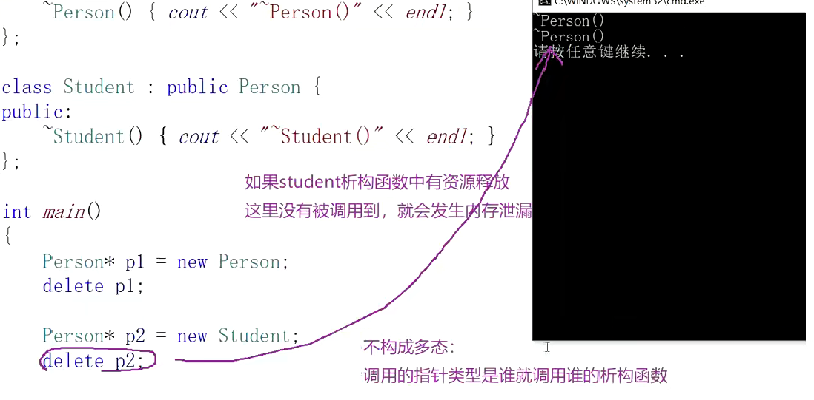
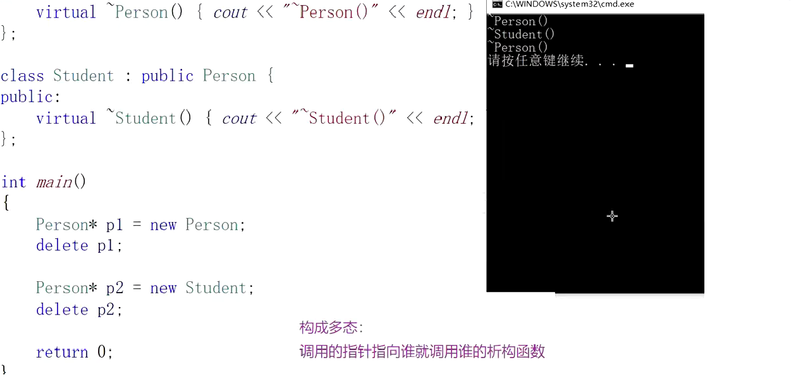
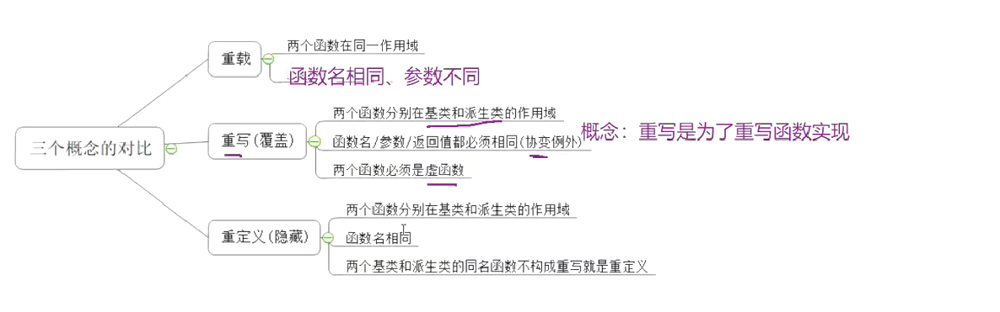
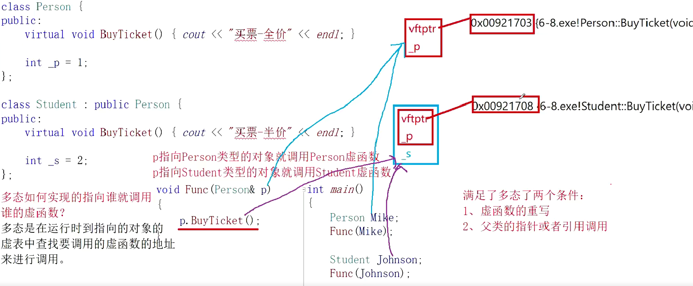
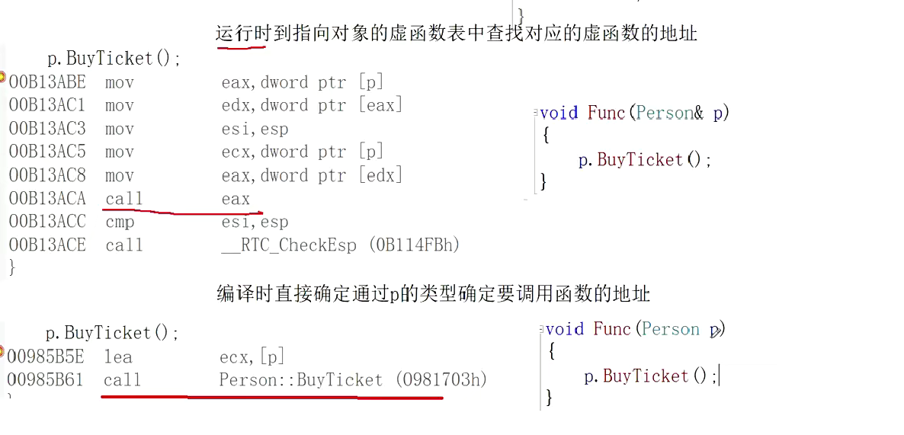

### 细枝末节

- 满足多态的条件：跟调用对象的类型无关，跟指向的对象有关，指向哪个对象就调用它的虚函数
- 不满足多态的条件：跟类型有关，调用的类型是谁，调用就是谁的
- 在继承中要构成多态还有两个条件：
    1. 必须通过基类的指针或者引用调用虚函数
    2. 被调用的函数必须是虚函数，且派生类必须对基类的虚函数进行重写(如果不是虚函数，那同名函数就是被隐藏的关系了，但要实现多态需要的是覆盖)
- virtual关键字可以修饰原函数，为了完成虚函数的重写，满足多态的条件之一
- 可以在菱形继承中，去完成虚继承，解决数据冗余和二义性
- 两个地方使用了同一个关键字，但它们之间没有一点关联


- 重写的虚函数要保证函数名，返回值，参数都是一样的
- 虚函数重写的两个例外：
    1. 协变(基类与派生类虚函数返回值类型不同)
    派生类重写基类虚函数时，与基类虚函数返回值类型不同。即基类虚函数返回基类对象的指
    针或者引用，派生类虚函数返回派生类对象的指针或者引用时，称为协变。（了解）
    2. 析构函数的重写(基类与派生类析构函数的名字不同)
    如果基类的析构函数为虚函数，此时派生类析构函数只要定义，无论是否加virtual关键字，
    都与基类的析构函数构成重写，虽然基类与派生类析构函数名字不同。虽然函数名不相同，
    看起来违背了重写的规则，其实不然，这里可以理解为编译器对析构函数的名称做了特殊处
    理，编译后析构函数的名称统一处理成destructor。
- 注意，派生类可以不写virtual，但不规范

- 析构函数是否要成为虚函数呢
- 如果不设为虚函数


- 如果设为虚函数



- 虚函数的重写是对实现重写，函数体是没有重写的

```
 class A
   {
   public:
       virtual void func(int val = 1){ 
    
    std::cout<<"A->"<< val <<std::endl;

    }

 
       virtual void test(){ func();}
   };
   
   class B : public A
   {
   public:
       void func(int val=0){ std::cout<<"B->"<< val <<std::endl; }
   };
   
   int main(int argc ,char* argv[])
   {
       B*p = new B;
       p->test();
       return 0;
   }
  A: A->0 B: B->1 C: A->1 D: B->0 E: 编译出错 F: 以上都不正确
  答案：B
 ```
- final:被它修饰的类或者虚函数就没法继承了
- override：检查子类的虚函数是否重写了父类的虚函数



### 抽象类
- 虚基类的概念：菱形继承中被多余继承的那个A，与纯虚函数无关，不要混淆
- 抽象类：不能实例化出对象
- 纯虚函数的作用：
    1.强制子类去完成重写  
    2. 表示抽象的类型

```
class Car
{
public:
	virtual void Drive() = 0;//不需要实现，纯虚函数:
};
class Benz :public Car
{
public:
	virtual void Drive()
	{

	}
};
```

### 多态原理

```
class Base
{
public:
	virtual void func()
	{

	}
private:
	int _b;
};
int main()
{
	Base b;
	std::cout << sizeof(b) << std::endl;
	return 0;
}在32位下是8，一个整形和一个指针吗，但为什么在64位下是16，不是因该是12吗
```
- 原因：虚函数表指针（vptr）大小 = 8 字节，int _b = 4 字节，但是，内存对齐要求这个结构体按照 8 字节对齐（因为 vptr 是 8 字节），因此，_b 后面会填充 4 字节，使得整个结构体大小为 16 字节
- 虚函数表其实就是一个指针数组
- 为什么普通函数不需要---粗糙理解，普通函数放在代码段，代码段有对应函数名和地址映射(函数第一条指令的地址)，但虚函数不行，它们的名字不能作为特异性. 指令是都放在代码段的，但虚函数就还单独把地址拿出来放在表上，从而实现了多态




- 虚函数存在哪
- 代码段
- 虚函数表在哪
- 代码段(常量区)

- 静态绑定 静态的多态 （静态：编译时）
```
void fun1(double d){}
void fun2(int d){}
int main()
{
	int i = 0;
	double d = 1.1;
	fun1(d);
	fun2(i);
	return 0;
}
```


- 动态绑定 动态的多态 （动态：运行时）
```
class Base
{
public:
	virtual void Func1()
	{
		cout << "Base::Func1()" << endl;
	}
};
class Derive : public Base
{
public:
	virtual void Func1()
	{
		cout << "Derive::Func1()" << endl;
	}
};
int main()
{
	Base *p=new Base;
	p->Func1();
	p = new Derive;
	p->Func1();
	
	return 0;
}
```

- 我们有时候通过调试里的监视窗口来看虚函数表，但这个窗口并不一定正确，这时我们也可以字节打印出来
- 单继承中的虚函数表
```
class Base {
public:
	virtual void func1() { cout << "Base::func1" << endl; }
	virtual void func2() { cout << "Base::func2" << endl; }
private:
	int a;
};
class Derive :public Base {
public:
	virtual void func1() { cout << "Derive::func1" << endl; }
	virtual void func3() { cout << "Derive::func3" << endl; }
	virtual void func4() { cout << "Derive::func4" << endl; }
private:
	int b;
};
typedef void(*VF_PTR)();//
void PrintVFTable(VF_PTR* pTable)
{
	for (size_t i = 0; pTable[i] != 0; i++)
	{
		printf("vfTable[%d]:%p->", i, pTable[i]);
		VF_PTR f = pTable[i];
		f();
	}
}
int main()
{
	Base b;
	Derive d;
	PrintVFTable((VF_PTR*)(*(int*)&b));//首先要取前4字节，只能用指针先转为int*，在解引用是int类型
	//再转为它这四个字节存的类型，函数指针(指向虚函数表)
	PrintVFTable((VF_PTR*)(*(int*)&d));
	return 0;
}
```

- 多继承中的虚函数表
```
class Base1 {
public:
	virtual void func1() { cout << "Base1::func1" << endl; }
	virtual void func2() { cout << "Base1::func2" << endl; }
private:
	int b1;
};
class Base2 {
public:
	virtual void func1() { cout << "Base2::func1" << endl; }
	virtual void func2() { cout << "Base2::func2" << endl; }
private:
	int b2;
};
class Derive : public Base1, public Base2 {
public:
	virtual void func1() { cout << "Derive::func1" << endl; }
	virtual void func3() { cout << "Derive::func3" << endl; }
private:
	int d1;
};
typedef void(*VF_PTR)();
void PrintVFTable(VF_PTR* pTable)
{
	for (size_t i = 0; pTable[i] != 0; i++)
	{
		printf("vfTable[%d]:%p->", i, pTable[i]);
		VF_PTR f = pTable[i];
		f();
	}
}
int main()
{
	cout << sizeof(Derive) << endl;//.20
	//Base1有8 Base有8 自己本来有4，(注意，因为它继承了父类，所以它继承了两张虚函数表，自身并没有创建，是覆盖
	Derive d;
	PrintVFTable((VF_PTR*)(*(int*)&d));
	PrintVFTable((VF_PTR*)(*(int*)((char*) &d+sizeof(Base1))));
	return 0;
}
```

- 内联函数不能是虚函数，因为它没有地址
- 虚函数表存的是虚函数的地址，虚基表存的是偏移量(菱形继承)
- 虚表是在编译时生成的，但里面存的地址是运行时初始化的
- 静态成员函数可以是虚函数吗》 不能，静态成员函数没有this指针，使用类型：：成员函数的调用方式没法访问虚函数表，也就是说静态成员函数没法放进虚函数表里
- 关于继承时基类的析构函数要是虚函数的问题
```
class A
{
public:
	virtual ~A()
	{
		cout << "A::~A()" << endl;
	}
};
class B :public A
{
public:
	~B()
	{
		cout << "B::~B()" << endl;
	}
};
int main()
{
	A* p = new B;
	delete p;//p->destructor()+operator delete(P）
	return 0;
}
```

- 虚基表在存哪里呢------代码段(常量区)
```
class A
{
public:
	int _a;
};
class B :virtual public A
{
public:
	int _b;
};
class C :virtual public A
{
public:
	int _c;
};
class D :public B,C
{
public:
	int _d;
};
int main()
{
	D d;
	printf("虚函数表：%p\n", *(int*)&d);
	static int x = 1;
	const char* p = "hello world";
	printf("数据段:%p\n", &x);
	printf("代码段(常量区):%p\n", p);
	return 0;
}
```