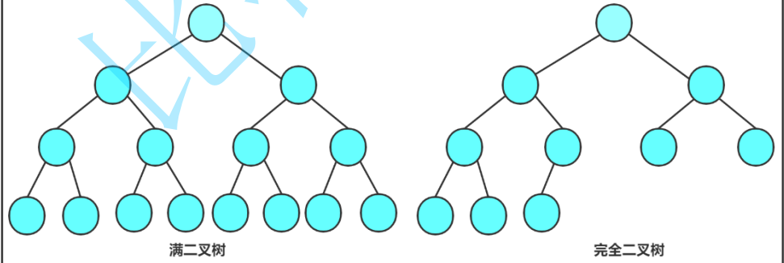

## 树
### 树概念及结构
- 树形结构，子树之间不能有交集
- 度：一个节点含有的子树的个数
- 树的度：最大的节点的度
- 叶节点：度为0的点
- 高度或深度：默认从1往下
### 二叉树
- 特殊的二叉树

- 性质
    1. 若规定根节点的层数为1，则一棵非空二叉树的第i层上最多有2^(i-1) 个结点.
    2. 若规定根节点的层数为1，则深度为h的二叉树的最大结点数是 2^i-1.
    3. 对任何一棵二叉树, 如果度为0其叶结点个数为n0 , 度为2的分支结点个数为n2 ,则有n0 ＝n2 ＋1
    4. 若规定根节点的层数为1，具有n个结点的满二叉树的深度，h=log2(n+1).
- 存储结构
    1. 顺序存储：顺序结构存储就是使用数组来存储，一般使用数组只适合表示完全二叉树，因为不是完全二叉树会有空间的浪费。而现实中使用中只有堆才会使用数组来存储，二叉树顺序存储在物理上是一个数组，在逻辑上是一颗二叉树。
    2. 链式存储
### 堆
- 堆模拟实现
```
#include"Heap.h"

//堆排序
void Heap_sort(int* a, int n)
{
	//建堆
	//先分析一下这里建堆的复杂度：首先每次adjustdowv用最坏的情况考虑是树的高度：lgn,所以整体复杂度为n*lgN，但是这种想法是错的
	// 因为不可能每次adjust都是树的高度次，用错位相减可得出时间复杂度为n
	//但是，如果建完堆之后呢，我们只能得出一个最小的数啊
	//降序：建小堆
	//升序：建立大堆
	/*如果我们每次建堆只能得出一个最小的数，那么这个排序算法又要是n*n的时间复杂度了，明显
	不能采纳，于是，采取这样的操作：首先，建完堆后，我们将最小的和nums[n-1]交换，然后除去那个最小的数来进行下调整。
	向下调整的时间复杂度是lgn，总共有n个数，所以总排序算法为n*lgn*/
	for (int i = (n - 1 - 1) / 2; i >= 0; i--)
	{
		AdjustDown(a, n, i);
	}
	int end = n - 1;
	while (end > 0)
	{
		Swap(&a[0], &a[end]);
		AdjustDown(a, end, 0);
		end--;
	}
}
void Swap(HPDataType* a, HPDataType* b)
{
	HPDataType tmp = *a;
	*a = *b;
	*b = tmp;
}
void AdjustDown(HPDataType* a, int n,int root)
{
	int parent = root;
	int child = 2 * parent + 1;
	while (child<n)//不懂为啥有这个//情景是一个根，两个小堆，如果整体不是小堆，要把根往下填
	{
		if (child+1<n&&a[child + 1] < a[child])child++;//这里又是为啥//先判断左右孩子谁最小好能够与父亲进行比较//条件child+1的判断是为了确定有右孩子
		if (a[child] < a[parent])
		{
			Swap(&a[child], &a[parent]);
			parent = child;
			child = 2 * parent + 1;
		}
		else break;
	}
}
void AdjustUp(HPDataType* a, int n, int child)
{
	int parent = (child - 1) / 2;
	while (child>0)
	{
		if (a[child] < a[parent])
		{
			Swap(&a[child], &a[parent]);
			child = parent;
			parent = (child - 1) / 2;
		}
		else break;
	}
}
void HeapInit(Heap* php, HPDataType* a, int n)
{
	php->_a = (HPDataType*)malloc(sizeof(HPDataType) * n);
	memcpy(php->_a, a, sizeof(HPDataType) * n);
	php->_size = n;
	php->_capacity = n;

	for (int i = (n - 1 - 1)/2 ; i >= 0; i--)//这里为啥是n-1-1//自己模拟一下就知道了，这里的i是指的根节点,由点到面
	{
		AdjustDown(php->_a, php->_size, i);
	}
}
void HeapDestory(Heap* php)
{
	assert(php);
	free(php->_a);
	php->_a = NULL;
	php->_capacity = php->_size = 0;
}
void HeapPush(Heap* php, HPDataType x)
{
	assert(php);
	if (php->_capacity == php->_size)
	{
		php->_capacity *= 2;
		HPDataType* tmp=(HPDataType*)realloc(php->_a, sizeof(HPDataType) * php->_capacity);
		php->_a = tmp;
	}
	php->_a[php->_size++] = x;
	AdjustUp(php->_a, php->_size, php->_size - 1);
}
void HeapPop(Heap* php)
{
	assert(php);
	assert(php->_size > 0);

	Swap(&php->_a[0], &php->_a[php->_size--]);
	AdjustDown(php->_a,php->_size, 0);
}
HPDataType HeapTop(Heap* php)
{
	assert(php);
	assert(php->_size > 0);

	return php->_a[0];
}
```
### 二叉树
```
#include<stdio.h>
#include<stdlib.h>

typedef char BTDataType;
typedef struct BinaryTreeNode
{
	BTDataType _data;
	struct BinaryTreeNode* _left;
	struct BinaryTreeNode* _right;
}BTNode;
//前序遍历
void PrevOrder(BTNode* root)
{
	if (root == NULL)return;
	printf("%c ", root->_data);
	PrevOrder(root->_left);
	PrevOrder(root->_right);
}

//中序遍历
void InOrder(BTNode* root)
{
	if (root == NULL)return;
	
	InOrder(root->_left);
	printf("%c ", root->_data);
	InOrder(root->_right);
}
//后序遍历
void BackOrder(BTNode* root)
{
	if (root == NULL)return;

	BackOrder(root->_left);
	
	BackOrder(root->_right);

	printf("%c ", root->_data);
}
//前中后序是深度，层序遍历是广度
//层序遍历一般就用队列来写了
BTNode* CreateNode(char x)
{
	BTNode* node = (BTNode*)malloc(sizeof(BTNode));
	node->_data = x;
	node->_left = node->_right = NULL;
	return node;
}


//void TreeSize(BTNode* root, int* psize)
//{
//	if (root == NULL)return;
//	else (*psize)++;
//	TreeSize(root->_left, psize);
//	TreeSize(root->_right, psize);
//}
//这种方法虽然可以，但是，它并不好用

//写这种会更加舒服
int TreeSize(BTNode* root)
{
	if (root == NULL)return 0;
	else
		return 1 + TreeSize(root->_left) + TreeSize(root->_right);
}
//求叶子节点的数目
int TreeLeafSize(BTNode* root)
{
	if (root == NULL)return 0;
	if (root->_left == NULL && root->_right == NULL)return 1;
	return TreeLeafSize(root->_left) + TreeLeafSize(root->_right);
}
//求k层的叶子节点个数
int BinaryTreeLevelKSize(BTNode* root, int k)
{
	if (root == NULL)return 0;
	if (k == 1)return 1;
	return BinaryTreeLevelKSize(root->_left, k - 1) + BinaryTreeLevelKSize(root->_right, k - 1);
}
//查找值为x
BTNode* BinaryTreeFind(BTNode* root, BTDataType x)
{
	if (root == NULL)
	{
		return NULL;

	}
	if (root->_data == x)return root;
	BTNode* node = BinaryTreeFind(root->_left, x);
	if (node)return node;
	node = BinaryTreeFind(root->_right, x);
	if (node)return node;
	return NULL;
}
//销毁
void* destroy(BTNode* root)
{
	if (root == NULL)return;
	destroy(root->_left);
	destroy(root->_right);
	free(root);

}
int main()
{
	BTNode* A = CreateNode('a');
	BTNode* B = CreateNode('b');
	BTNode* C = CreateNode('c');
	BTNode* D = CreateNode('d');
	BTNode* E = CreateNode('e');
	A->_left = B;
	A->_right = C;
	B->_left = D;
	B->_right = E;
	PrevOrder(A);
	printf("\n");
	InOrder(A);
	printf("\n");
	BackOrder(A);
	return 0;
}
```