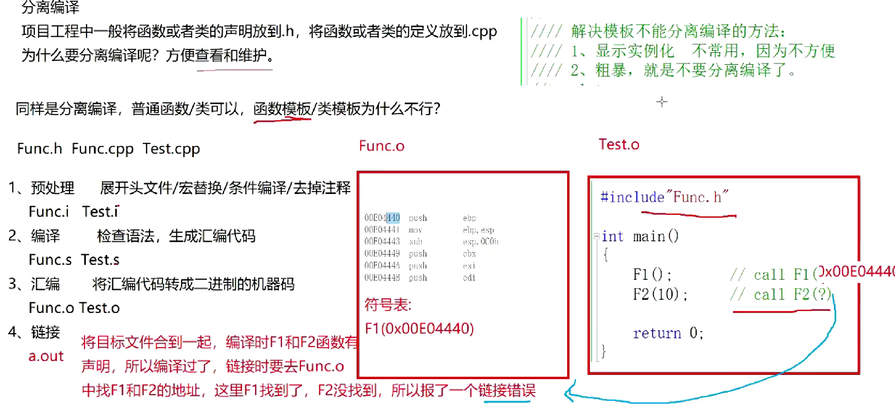

### 非类型模板参数
```
//非类型模板参数
//不是什么都可以作非类型模板参数，基本是int(char也可以。像double，自定义类型string都不行
template<class T,int N>
class Array
{
public:
private:
	T _a[N];
};
```

### 模板的特化
```
template<class T>
bool IsEqual(T& left, T& right)
{
	return left == right;
}
template<>
bool IsEqual<char*>(char*& left, char*& right)
{
	return strcmp(left, right) == 0;
}
//全特化：全部的参数都特化
template<>
class Date<int,char>
{
public:
	Date()
	{
		cout << "全特化Date()" << endl;
	}
private:

};
//偏特化
template<class T2>
class Date<int, T2>
{
public:
	Date()
	{
		cout << "偏特化Date()" << endl;
	}
private:

};
template<class T1,class T2>
class Date<T1*, T2*>//传来的是指针就调用的这个
{
public:
	Date()
	{
		cout << "偏特化Date()" << endl;
	}
private:

};
template<class T1, class T2>
class Date
{
public:
	Date()
	{
		ocut << "Date(T1,T2)" << endl;
	}
private:
	T1 _d1;
	T2 _d2;
};
```

### 分离编译
- 项目工程中一般将函数或者类的声明放到.h文件，将函数或者类的定义放到.cpp
- 为什么要分离编译----方便查看和维护
- 模板是不能分离编译的。----普通函数可以，但函数模板和类模板不行



- 原因：兵不识将，将不识兵，调用的地方知道具体的类型却没有具体实现，有函数定义的地方却因为不知道具体参数类型没有实例化出对应的函数。
- 解决方法：
    - 显示实例化(不常用，失去了模板本身想要的作用)
    - 不要分离编译（直接将实现放在.h文件中，头文件包含的时候就在同一文件中了）

### 模板总结
- 优点
	- 模板复用了代码，节省资源，更快的迭代开发（STL因此产生）
	- 增强了代码的灵活性
- 缺点
	- 模板会导致代码膨胀问题，也会导致编译时间变长
	- 出现模板编译错误时，错误信息非常凌乱，不易定位错误