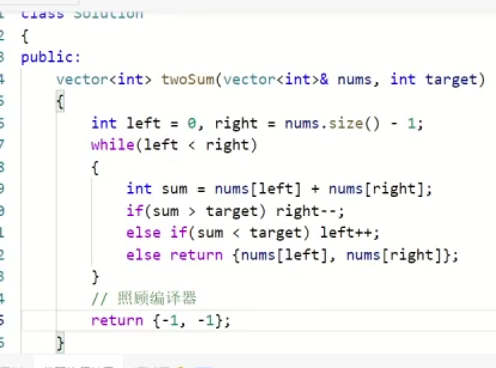

**https://leetcode.cn/problems/move-zeroes/**
```
    //1.定义dest和cur：dest记录处理的，非0的最后一个元素，cur记录当前处理的元素
        int dest=-1;
        int cur=0;
        //2.cur循环从0-n-1
        while(cur!=nums.size())
        {
            //3.判断：1.如果为0不用进行什么操作2.如果非0要与dest+1交换
            if(nums[cur]!=0)
            {
                swap(nums[cur],nums[++dest]);
            }
            cur++;
        }
```


**https://leetcode.cn/problems/duplicate-zeros/submissions/643155573/**

```
//遍历的时候一定要以cur指针，这样逻辑上才合理
class Solution {
public:
    void duplicateZeros(vector<int>& arr) {
        int dest=-1;
        int cur=0;
        while(cur<arr.size())
        {
            if(arr[cur])dest++;
            else dest+=2;
            if(dest>=arr.size()-1)break;
            cur++;
        }
        
        //通过以上操作，确定了dest和cur的位置
        //特殊条件
        if(dest==arr.size())
        {
            arr[arr.size()-1]=0;
            dest-=2;
            cur--;
        }
        while(cur>=0)
        {
            if(arr[cur])arr[dest--]=arr[cur--];
            else
            {
                arr[dest--]=0;
                arr[dest--]=0;
                cur--;
            }
        }
    }
};
```
**https://leetcode.cn/problems/happy-number/description/**

启示：
- 快慢指针（Floyd判圈算法）判断链表是否有环的思路：使用两个指针，一个快指针（每次移动两步），一个慢指针（每次移动一步）。如果链表中存在环，那么快指针最终会追上慢指针（即两者相遇）；如果不存在环，快指针会先到达链表尾部（NULL）。
- 如果一个数最终总是经过操作总是在一个范围内，要考虑是否经过操作始终是在循环内
```
class Solution {
public:
    int bitSum(int k)
    {
        int sum=0;
        while(k)
        {
            int t=k%10;
            sum+=t*t;
            k/=10;
        }
           
        return sum;
    }
    bool isHappy(int n) {
        //设置快慢指针
        int slow=n,fast=bitSum(n);
        while(slow!=fast)
        {
            slow=bitSum(slow);
            fast=bitSum(bitSum(fast));
        }
        return slow==1;
    }
};
```

**https://leetcode.cn/problems/container-with-most-water/description/**

利用单调性寻找到规律，用对撞指针求解(不好想，多做题，总结规律)
```
class Solution {
public:
    int maxArea(vector<int>& height) {
        int left=0;
        int right=height.size()-1;
        int max=0;
        while(left!=right)
        {
            int tmp;
            //如果小的话就得叉掉
            //记得记录每次的值进行跟新
            if(height[left]<height[right])
            {
                tmp=(right-left)*height[left];
                left++;
            }
            else
            {
                tmp=(right-left)*height[right];
                right--;
            }
            if(tmp>max)
            {
                max=tmp;
            }

        }
        return max;
    }
};
```
**https://leetcode.cn/problems/valid-triangle-number/**

1. 排完序
2. 先固定最大的数
3. 在最大数的左区间内，使用双指针算法，快速统计符合要求的数(其实一般有单调性的一般很有可能就有特殊规律)
```
class Solution {
public:
    int triangleNumber(vector<int>& nums) {
        sort(nums.begin(),nums.end());
        int n=nums.size()-1;
        int ans=0;
        for(int i=n;i>0;i--)
        {
            int left=0;
            int right=i-1;
            while(left<right)
            {
                if(nums[left]+nums[right]>nums[i])
                {
                    ans+=right-left;
                    right--;
                }
                else
                {
                    left++;
                }
            }
        }
        return ans;
    }
};
```

**https://leetcode.cn/problems/he-wei-sde-liang-ge-shu-zi-lcof/description/**
1. 看到这道题，很容易能想到它的暴力解法，两层for吗，但明显没有利用到题目单调性的条件
2. 这时，又想到到通过二分找到最接近目标值的点，然后，双指针从中间向两边跑，但这也不是最佳的写法
3. 其实这种思路不应该没有想到，和上一道题目是一样的
    - 首先，直接从两边开始遍历
    - 如果r+L==ans，找到了
    - 如果r+L<ans,说明L这个位置是绝不可能是目标值，所以L++
    - 如果r+L>ans,说明r这个位置是绝不可能是目标值，所以r--
```
class Solution {
public:
    vector<int> twoSum(vector<int>& price, int target) {
        int left=0;
        int right=price.size()-1;
        while(right>left)
        {
            if(price[right]+price[left]>target)
                right--;
            else if(price[right]+price[left]<target)
                left++;
            else
                break;
        }
        vector<int>ans;
        ans.push_back(price[left]);
        ans.push_back(price[right]);
        return ans;
    }
};
```



**https://leetcode.cn/problems/3sum/**
```
class Solution {
public:
    vector<vector<int>> threeSum(vector<int>& nums) {
        sort(nums.begin(),nums.end());
        vector<vector<int>>kkk;
        int k=nums.size()-1;
        for(int i=k;i>0;)
        {
            if(nums[i]<0)break;
            int left=0;
            int right=i-1;
            while(left<right)
            {
                if(nums[right]+nums[left]>-nums[i])right--;
                else if(nums[right]+nums[left]<-nums[i])left++;
                else
                {
                    kkk.push_back({nums[left],nums[right],nums[i]});
                    left++;
                    right--;
                    while(left<right&&nums[left]==nums[left-1])left++;
                    while(left<right&&nums[right]==nums[right+1])right--;
                }
            }
            i--;
            while(i>0&&nums[i]==nums[i+1])i--;
        }
        return kkk;
    }
};
```

**https://leetcode.cn/problems/4sum/**
```
class Solution {
public:
    vector<vector<int>> fourSum(vector<int>& nums, int target) {
        sort(nums.begin(),nums.end());
        vector<vector<int>>ret;
        int k=nums.size();
        for(int i=0;i<k-3;)
        {
            for(int j=i+1;j<k-2;)
            {
                int left=j+1;
                int right=k-1;
                long long aim=(long long)target-nums[i]-nums[j];//真想骂死你。卡了我好久···········
                while(left<right)
                {
                    long long sum=nums[left]+nums[right];
                    if(sum<aim)
                        left++;
                    else if(sum>aim)
                        right--;
                    else
                    {
                        ret.push_back({nums[left],nums[right],nums[i],nums[j]});
                        left++;
                        right--;
                        while(left<right&&nums[left]==nums[left-1])left++;
                        while(left<right&&nums[right]==nums[right+1])right--;
                    }

                }
               j++;
               while(j<k-2&&nums[j]==nums[j-1])j++;

            }
            i++;
            while(i<k-3&&nums[i]==nums[i-1])i++;
        }
        return ret;
    }
};
```