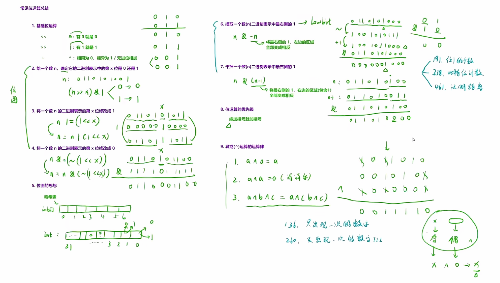

**https://leetcode.cn/problems/is-unique-lcci/**
```
class Solution {
public:
    bool isUnique(string astr) {
        if(astr.size()>26)return false;
        int bitmap=0;
        for(auto e:astr)
        {
            int k=e-'a';
            if((bitmap>>k)&1==1) return false;
            else bitmap|=(1<<k);
        }
        return true;
    }
};
```