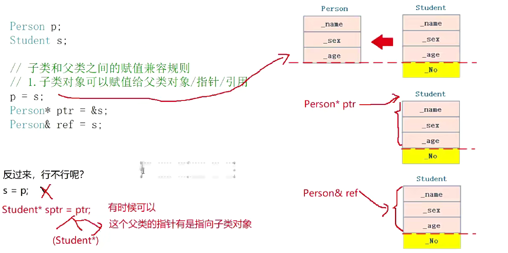
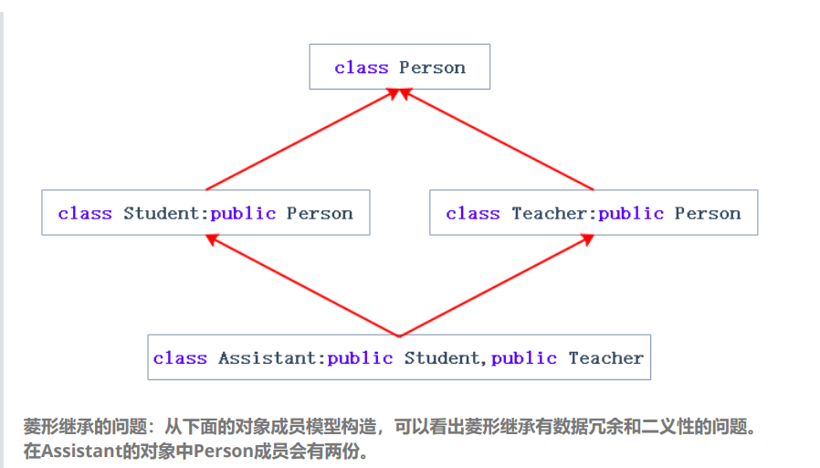
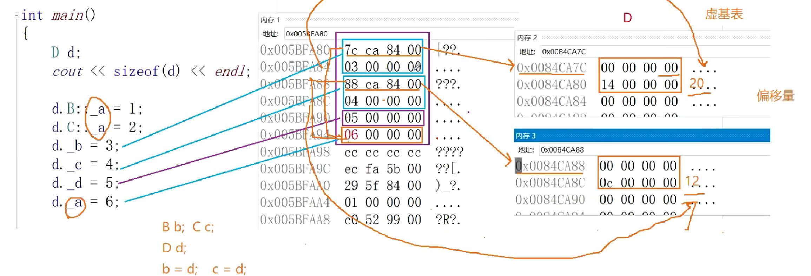

### 细枝末节
```
class Person
{
public:
	void Print()
	{
		cout << _num;
	}
protected:
	int _num=999;

};
class Student:public Person
{
public:
	void Print()
	{
		cout << _num;
	}
protected:
	int _num = 111;//会把父类的_num隐藏，必须通过作用域

};
class A
{
public:
	void fun()
	{
		cout << "hello" << endl;
	}
};
class B :public A
{
public:
	void fun(int a)
	{
		cout << "haha" << endl;
	}
};
int main()
{
	B tmp;
	tmp.fun();//报错，找不到，虽然参数不同，但只要函数名相同，子类就把父类的隐藏了,加作用域能找到
	//A和B的fun构成关系：A 重载 B 重写 C 重定义 
	//答案：C       重载要求必须在同一作用域
	return 0;
}
```




```
class Person
{
public:
	Person(int num)
		:_num(num){}
	void Print()
	{
		cout << _num;
	}
	Person(const Person& p)
		:_num(p._num){}
	Person& operator=(const Person& p)
	{
		if (this != &p)
		{
			_num = p._num;
		}
		return *this;
	}
protected:
	int _num;

};
class Student:public Person
{
public:
	Student(int num, int id)
		: Person(num)
		,_id(id){}
	void Print()
	{
		cout << _id;
	}
	//拷贝构造
	Student(const Student& s)
		:Person(s)//子类是可以赋给父类的，因为会自动截取
		,_id(s._id){}
	//赋值运算符重载
	Student& operator=(const Student& s)
	{
		if (this != &s)
		{
			Person::operator=(s);//自己会完成切片,但要加作用域，因为被隐藏了
			_id = s._id;
		}
		return *this;
	}
	~Student()
	{
		//~Person();//子类的析构函数和父类的析构函数构成隐藏，因为它们的名字会被编译器统一处理成
		//destructor(跟多态有关
		//Person::~Person();实际上不能写：结束时，会自动调用父类的析构函数，因为
		//这样才能保证先析构子类在析构父类
	}
protected:
	int _id ;//会把父类的_num隐藏，必须通过作用域
	
};
```

- 怎么弄个不能被继承的类？
- 把构造函数私有化

### 菱形继承

```
class Person
{
public:
	string _name; // 姓名
};
class Student : public Person
{
protected:
	int _num; //学号
};
class Teacher : public Person//虚拟继承可以解决菱形继承的二义性和数据冗余的问题。如上面的继承关系，在Student和
	//Teacher的继承Person时使用虚拟继承，即可解决问题。需要注意的是，虚拟继承不要在其他地
	//方去使用。

	/*虚拟继承解决数据冗余和二义性的原理
	为了研究虚拟继承原理，我们给出了一个简化的菱形继承继承体系，再借助内存窗口观察对象成
	员的模型。*/
{
protected:
	int _id; // 职工编号
};
class Assistant : public Student, public Teacher
{
protected:
	string _majorCourse; // 主修课程
};
void Test()
{
	// 这样会有二义性无法明确知道访问的是哪一个
	Assistant a;
	//a._name = "peter";

	// 需要显示指定访问哪个父类的成员可以解决二义性问题，但是数据冗余问题无法解决
	a.Student::_name = "xxx";
	a.Teacher::_name = "yyy";
}
```

- C++的缺陷有哪些》多继承就是一个问题》菱形继承》虚继承》底层结构的对象模型非常复杂，且有一定效率损失
- 菱形继承是什么》菱形继承的问题是什么》如何解决》虚继承》原理是什么

```
class A
{
public:
	int _a;
};
 //class B : public A
class B : virtual public A
{
public:
	int _b;
};
 //class C : public A
class C : virtual public A
{
public:
	int _c;
};
class D : public B, public C
{
public:
	int _d;
};
int main()
{
	D d;
	cout << sizeof(d) << endl;

	d.B::_a = 1;
	d.C::_a = 2;
	d._b = 3;
	d._c = 4;
	d._d = 5;

	return 0;
}
```
- 这段代码值得细细分析：首先，没有虚继承时，很明显sizeof(d)为20字节，虚继承后，并不是预料的16字节，而是24字节，这是为啥呢
- 原因是：D里面要存继承来的_b,_c,_a之外，如果B b=d,请问要怎么切片给它呢，找到_b容易，但找到_a不容易啊，因为它被单独重新放在一块区域，所以，它还需要对应一个指针，帮它找到_a，于是，通过该指针可以找到对应一张虚基表，表上有着虚基类的地址的偏移量，对此也就找到了_a能切片给它，也就是说，D要存使得两个父类能找到虚基表的指针，也就是说总共存_b,_c,_a之外还有两个地址以及自身的_d,总共24字节；
- 注意：对应指针并不一定里面存的就是偏移量，因为该指针的目的是找到虚基表，表上可能还有其它信息；




### 继承和组合
- 组合：类里有一个成员对象
- 对比：
	- 继承是一种白箱复用，父类对于子类基本是透明的，但是它一定程度破坏了父类封装
	- 组合是一种黑箱复用，C对D是不透明的，C保持着它的分装性
	- 组合的类耦合度低，继承的类是一种高耦合
	- 两者都完成对类层次的复用

- 那用哪种呢？
- 符合is-a就使用继承，符合has-a就使用组合。都可以，优先使用组合